# Technical Requirements Document: Main Cost Driver Tab

> **Scope**: This document covers the **Main Cost Driver** tab of the Finance Cost Monitoring Dashboard — the data flow from backend API to frontend rendering, all UI features visible in the reference mockups, and implementation guidance including sortable table headers.

---

## 1. Overview

The **Main Cost Driver** tab provides a breakdown of cost differences by **main cost type** (the top-level `costline_increases_trajectory` array). When a user selects a project and clicks **Run Analysis**, this tab displays:

1. **Main Cost Type Breakdown** heading with a "Selected Project" dropdown
2. **Main Cost Type Differences** — a horizontal bar chart showing the difference values per main cost type, color-coded with a green-to-red gradient based on magnitude
3. **Data Table** — a 4-column table with `category`, `file1_metric`, `file2_metric`, `difference`, featuring **sortable column headers** (click to toggle ascending/descending order)

---

## 2. Data Flow: End-to-End

The Main Cost Driver tab shares the same data pipeline as the Project Summary tab. **No additional API calls are needed.** The data is already fetched and stored in the Zustand store.

```
Sidebar filters → Zustand store → DataFetcher → POST /api/analysis/forecast-comparison → Backend → Zustand store → MainCostDriver component → render
```

### 2.1 Data Source

The Main Cost Driver tab consumes `projectAnalysisData.costline_increases_trajectory` from the Zustand store — the **same data** that is already fetched by [DataFetcher.tsx](file:///Users/jerryjose/Code/cost-dashboard/nextjs-frontend/app/components/dashboard/DataFetcher.tsx) when a user runs analysis.

```mermaid
sequenceDiagram
    participant Store as Zustand Store
    participant Component as MainCostDriver
    participant Chart as HorizontalBarChart
    participant Table as SortableTable

    Store->>Component: projectAnalysisData.costline_increases_trajectory
    Component->>Component: Extract top-level items (main cost types)
    Component->>Chart: Pass sorted data (by difference magnitude)
    Component->>Table: Pass data with sort state
    Table->>Table: User clicks header → toggle sort order
```



### 2.2 Key Files in the Data Flow

| Step             | File                                                                                                                                      | Role                                                                       |
| ---------------- | ----------------------------------------------------------------------------------------------------------------------------------------- | -------------------------------------------------------------------------- |
| User input       | [Sidebar.tsx](file:///Users/jerryjose/Code/cost-dashboard/nextjs-frontend/app/components/dashboard/Sidebar.tsx)                           | Renders filter dropdowns. Calls `runAnalysis()` on button click.           |
| State management | [useDashboardStore.ts](file:///Users/jerryjose/Code/cost-dashboard/nextjs-frontend/app/store/useDashboardStore.ts)                        | Holds `projectAnalysisData` with `costline_increases_trajectory`.          |
| Data fetching    | [DataFetcher.tsx](file:///Users/jerryjose/Code/cost-dashboard/nextjs-frontend/app/components/dashboard/DataFetcher.tsx)                   | Fetches data via `fetchForecastComparison()` and stores result.            |
| API client       | [api.ts](file:///Users/jerryjose/Code/cost-dashboard/nextjs-frontend/app/lib/api.ts)                                                      | `fetchForecastComparison()` — POST to `/api/analysis/forecast-comparison`. |
| Backend          | [data_processor.py](file:///Users/jerryjose/Code/cost-dashboard/backend-api/app/services/data_processor.py)                               | `compute_forecast_diff()` builds `costline_increases_trajectory`.          |
| **Rendering**    | [CostBreakdownView.tsx](file:///Users/jerryjose/Code/cost-dashboard/nextjs-frontend/app/components/dashboard/views/CostBreakdownView.tsx) | **Current** implementation — needs significant rework.                     |

---

## 3. API Contract

### 3.1 Request: `POST /api/analysis/forecast-comparison`

```json
{
  "from_period": "202305",
  "to_period": "202312",
  "project_no": 2377,
  "metric": "forecast_costs_at_completion"
}
```

### 3.2 Response — Relevant Section for Main Cost Driver

The Main Cost Driver tab uses only the `costline_increases_trajectory` array from the response. Each item represents a **main cost type** (the top level of the 3-tier hierarchy):

```json
{
  "projects": {
    "2377 & 8353": {
      "project_meta": {
        "description": "EPC for Belbazem Block Development Project - Onshore Part",
        "client": "Al Yasat Petroleum"
      },
      "total_forecast_costs_at_completion": { ... },
      "costline_increases_trajectory": [
        {
          "category": "30 - subcontractor costs",
          "file1_metric": 644279.0,
          "file2_metric": 691939.0,
          "difference": 47660.0,
          "subcategories": [ ... ]
        },
        {
          "category": "20 - project material costs",
          "file1_metric": 1155117.0,
          "file2_metric": 1183216.0,
          "difference": 28099.0,
          "subcategories": [ ... ]
        },
        {
          "category": "01 - resources & related cost",
          "file1_metric": 327704.0,
          "file2_metric": 353821.0,
          "difference": 26117.0,
          "subcategories": [ ... ]
        }
      ]
    }
  }
}
```

> [!NOTE]
> The `subcategories` and `children` nested arrays are **not used** on this tab — they are consumed by the Sub Categories and Sub-Subcategories tabs respectively. The Main Cost Driver tab only uses the top-level fields: `category`, `file1_metric`, `file2_metric`, and `difference`.

### 3.3 TypeScript Types (Frontend)

From [api.ts](file:///Users/jerryjose/Code/cost-dashboard/nextjs-frontend/app/lib/api.ts):

```typescript
export interface CostlineTrajectory {
  category: string; // e.g. "30 - subcontractor costs"
  file1_metric: number; // Value in period 1 (in thousands)
  file2_metric: number; // Value in period 2 (in thousands)
  difference: number; // file2_metric - file1_metric
  subcategories: CostlineSubcategory[]; // Not used on this tab
}
```

### 3.4 Backend Origin

The `costline_increases_trajectory` is built by [compute_forecast_diff()](file:///Users/jerryjose/Code/cost-dashboard/backend-api/app/services/data_processor.py#L150-L264) in `data_processor.py`, which:

1. Calls `aggregate_costlines_trajectory()` for each period's data
2. Computes per-cost-type totals and differences
3. Returns the array sorted by `difference` in **descending** order (highest difference first)

---

## 4. UI Features & Components Breakdown

### 4.1 Page Title & Selected Project Dropdown

| Property                   | Detail                                                                                                                          |
| -------------------------- | ------------------------------------------------------------------------------------------------------------------------------- |
| **Page title**             | `"Main Cost Type Breakdown"` — static heading                                                                                   |
| **Selected Project label** | `"Selected Project"` — subtitle text                                                                                            |
| **Dropdown display**       | Shows the project key (e.g., `"2377 & 8353"`) with a chevron. Clicking it reveals the full project meta (description + client). |
| **Data source**            | `projectKey` from the Zustand store, `projectAnalysisData.project_meta` for description/client                                  |
| **Current implementation** | ❌ Not implemented. The current `CostBreakdownView` has no project dropdown.                                                    |

**Implementation**: Reuse the same dropdown pattern from [ProjectSummary.tsx#L145-L177](file:///Users/jerryjose/Code/cost-dashboard/nextjs-frontend/app/components/dashboard/views/ProjectSummary.tsx#L145-L177).

```tsx
// At the top of the MainCostDriver component
<div>
  <h2 className="text-lg font-semibold text-white">Main Cost Type Breakdown</h2>
  <p className="mt-1 text-sm text-slate-400">Selected Project</p>

  <div className="relative mt-2 inline-block w-full max-w-md">
    <button
      onClick={() => setIsDropdownOpen(!isDropdownOpen)}
      className="flex w-full items-center justify-between rounded border border-slate-700 bg-slate-900 px-4 py-2.5 text-left text-sm text-white hover:border-slate-600 transition-colors"
    >
      <span>{projectKey}</span>
      <ChevronDown
        size={16}
        className={`ml-2 text-slate-400 transition-transform ${isDropdownOpen ? "rotate-180" : ""}`}
      />
    </button>

    {isDropdownOpen && (
      <div className="absolute z-10 mt-1 w-full rounded border border-slate-700 bg-slate-900 p-3 shadow-xl">
        <p className="text-sm text-slate-300 leading-relaxed">
          {projectKey} — {data.project_meta.description} (
          {data.project_meta.client})
        </p>
      </div>
    )}
  </div>
</div>
```

---

### 4.2 Main Cost Type Differences — Horizontal Bar Chart

| Property                   | Detail                                                                                                                                                                                                                                    |
| -------------------------- | ----------------------------------------------------------------------------------------------------------------------------------------------------------------------------------------------------------------------------------------- |
| **Chart type**             | Horizontal bar chart (Recharts `BarChart` with `layout="vertical"`)                                                                                                                                                                       |
| **Data**                   | `costline_increases_trajectory` items, sorted by `difference` descending                                                                                                                                                                  |
| **Y-Axis**                 | Category names (truncated in the mockup with `...` for long names)                                                                                                                                                                        |
| **X-Axis**                 | Difference values (labeled `"Difference (Current - Previous Period)"`)                                                                                                                                                                    |
| **Bar coloring**           | **Gradient scale** from green (large positive) → yellow (medium) → red (negative). This is a continuous color scale, NOT just two colors.                                                                                                 |
| **Legend**                 | A vertical gradient legend bar labeled `"Difference"` with scale values (0 to ~50)                                                                                                                                                        |
| **Current implementation** | ❌ The current [VarianceBarChart.tsx](file:///Users/jerryjose/Code/cost-dashboard/nextjs-frontend/app/components/dashboard/charts/VarianceBarChart.tsx) uses only red/green 2-color logic. Needs replacement with a gradient color chart. |

#### 4.2.1 Color Gradient Logic

The mockup shows a **continuous color gradient** based on the difference value:

- **Large positive** differences → bright green (e.g. `#22c55e`)
- **Medium positive** differences → yellow/amber (e.g. `#eab308`)
- **Small positive** differences → orange (e.g. `#f97316`)
- **Negative** differences → red (e.g. `#ef4444`)

Implementation approach — compute a normalized color for each bar:

```typescript
function getDifferenceColor(value: number, maxValue: number): string {
  if (value < 0) return "#ef4444"; // Red for negative

  // Normalize to 0-1 range based on max difference
  const ratio = Math.min(value / maxValue, 1);

  // Interpolate: red (0) → yellow (0.5) → green (1)
  if (ratio < 0.5) {
    // Red to Yellow
    const t = ratio * 2;
    const r = 239;
    const g = Math.round(68 + (179 - 68) * t); // 68 → 179
    const b = Math.round(68 + (8 - 68) * t); // 68 → 8
    return `rgb(${r}, ${g}, ${b})`;
  } else {
    // Yellow to Green
    const t = (ratio - 0.5) * 2;
    const r = Math.round(234 + (34 - 234) * t); // 234 → 34
    const g = Math.round(179 + (197 - 179) * t); // 179 → 197
    const b = Math.round(8 + (94 - 8) * t); // 8 → 94
    return `rgb(${r}, ${g}, ${b})`;
  }
}
```

#### 4.2.2 Gradient Legend

The mockup shows a vertical gradient legend bar on the right side of the chart, labeled "Difference" with numeric scale values. This can be implemented as a custom SVG element:

```tsx
// Custom gradient legend component
function GradientLegend({ maxValue }: { maxValue: number }) {
  return (
    <div className="flex flex-col items-center ml-4">
      <span className="text-xs text-slate-400 mb-1">Difference</span>
      <div
        className="w-4 h-48 rounded"
        style={{
          background: "linear-gradient(to bottom, #22c55e, #eab308, #ef4444)",
        }}
      />
      <div className="flex flex-col justify-between h-48 ml-2 text-xs text-slate-400">
        <span>{Math.round(maxValue)}</span>
        <span>{Math.round(maxValue / 2)}</span>
        <span>0</span>
      </div>
    </div>
  );
}
```

#### 4.2.3 Chart Container

| Property     | Value                                                           |
| ------------ | --------------------------------------------------------------- |
| Height       | ~400px (enough for 10-15 bars)                                  |
| Y-Axis width | 150px (for category labels)                                     |
| X-Axis label | `"Difference (Current - Previous Period)"`                      |
| Grid         | Dashed grid lines (`strokeDasharray="3 3"`, `stroke="#334155"`) |
| Tooltip      | Dark theme tooltip showing exact value                          |

---

### 4.3 Data Table with Sortable Headers

This is the primary feature addition. The mockup shows a data table below the chart.

| Property                   | Detail                                                                                                                    |
| -------------------------- | ------------------------------------------------------------------------------------------------------------------------- |
| **Columns**                | `category`, `file1_metric`, `file2_metric`, `difference`                                                                  |
| **Column headers**         | Display as table header labels. Sortable — clicking toggles between ascending and descending order.                       |
| **Row index**              | A numeric row index column (0-based: 0, 1, 2, ...) shown on the far left                                                  |
| **Data source**            | `projectAnalysisData.costline_increases_trajectory` — top-level items only                                                |
| **Default sort**           | By `difference` descending (matches the API response default order)                                                       |
| **Number formatting**      | Raw numeric values with 3 decimal places (locale-formatted), as shown in the mockup (e.g., `644.279`, `691.939`, `47.66`) |
| **Current implementation** | ❌ Current table has only 2 columns (`category`, `difference`). No sort controls.                                         |

#### 4.3.1 Table Column Definitions

| Column Header  | Data Field      | Alignment | Description                                              |
| -------------- | --------------- | --------- | -------------------------------------------------------- |
| `category`     | `.category`     | Left      | Main cost type name (e.g., `"30 - subcontractor costs"`) |
| `file1_metric` | `.file1_metric` | Right     | Metric value for period 1 (from period)                  |
| `file2_metric` | `.file2_metric` | Right     | Metric value for period 2 (to period)                    |
| `difference`   | `.difference`   | Right     | `file2_metric - file1_metric`                            |

> [!IMPORTANT]
> The mockup shows the values **in their raw form** (in thousands), NOT converted to millions like on the Project Summary tab. For example, `644.279` in the table corresponds to `644,279` in the raw API response (the value is displayed with a decimal point at the thousands position). Verify the exact formatting by checking the live API response.
>
> If the raw API returns `644279.0`, then the display value `644.279` in the mockup is obtained by dividing by `1000`. This aligns with the dashboard's convention of displaying values in millions. However, cross-reference with actual data to confirm.

#### 4.3.2 Sortable Column Headers — Implementation

Each column header acts as a toggle button. Clicking it sorts the table by that column, alternating between ascending and descending order. A sort indicator arrow (`↑` or `↓`) appears next to the active sort column.

**State management** (local component state):

```typescript
type SortColumn = "category" | "file1_metric" | "file2_metric" | "difference";
type SortDirection = "asc" | "desc";

const [sortColumn, setSortColumn] = useState<SortColumn>("difference");
const [sortDirection, setSortDirection] = useState<SortDirection>("desc");

const handleSort = (column: SortColumn) => {
  if (sortColumn === column) {
    // Toggle direction
    setSortDirection((prev) => (prev === "asc" ? "desc" : "asc"));
  } else {
    // New column, default to descending
    setSortColumn(column);
    setSortDirection("desc");
  }
};
```

**Sorting logic**:

```typescript
const sortedData = useMemo(() => {
  if (!data) return [];

  const items = [...data.costline_increases_trajectory];

  items.sort((a, b) => {
    let comparison: number;

    if (sortColumn === "category") {
      comparison = a.category.localeCompare(b.category);
    } else {
      comparison = a[sortColumn] - b[sortColumn];
    }

    return sortDirection === "asc" ? comparison : -comparison;
  });

  return items;
}, [data, sortColumn, sortDirection]);
```

**Sortable header rendering**:

```tsx
function SortableHeader({
  label,
  column,
  currentSort,
  currentDirection,
  onSort,
}: {
  label: string;
  column: SortColumn;
  currentSort: SortColumn;
  currentDirection: SortDirection;
  onSort: (col: SortColumn) => void;
}) {
  const isActive = currentSort === column;
  return (
    <th
      className="px-6 py-3 cursor-pointer select-none hover:text-white transition-colors"
      onClick={() => onSort(column)}
    >
      <span className="inline-flex items-center gap-1">
        {isActive && (
          <span className="text-blue-400">
            {currentDirection === "asc" ? "↑" : "↓"}
          </span>
        )}
        {label}
      </span>
    </th>
  );
}
```

#### 4.3.3 Table Styling

The mockup shows a dark-themed table consistent with the rest of the dashboard:

| Element               | Style                                                        |
| --------------------- | ------------------------------------------------------------ |
| Header row background | `bg-slate-900` or similar dark                               |
| Header text           | Uppercase, small, `text-slate-400`                           |
| Row background        | Transparent/dark, alternating optional                       |
| Row dividers          | `divide-y divide-slate-800`                                  |
| Text color (values)   | `text-slate-300` for values, `text-white` for category names |
| Active sort indicator | Blue-tinted arrow (`text-blue-400`)                          |

#### 4.3.4 Table Toolbar

The mockup screenshots show small toolbar icons (download, search, expand) in the top-right corner of the table area. These appear to be Recharts/Plotly default toolbar controls. Since this is a custom table (not a charting library table), these can be:

- **Download**: A small icon button to export the table data as CSV
- **Search**: Optional filter/search box for the category column
- **Expand**: Full-screen toggle for the table

> [!TIP]
> For the MVP, implement only the **download as CSV** button. Search and expand can be deferred.

---

## 5. Data Mapping: API Response → UI Element

| UI Element             | API Response Path                                | Transform                       | Example Value                |
| ---------------------- | ------------------------------------------------ | ------------------------------- | ---------------------------- |
| Page title             | Static                                           | None                            | `"Main Cost Type Breakdown"` |
| Selected Project key   | `projectKey` (from store)                        | Direct                          | `"2377 & 8353"`              |
| Project description    | `.project_meta.description`                      | Direct                          | `"EPC for Belbazem..."`      |
| Bar chart Y-Axis label | `.costline_increases_trajectory[n].category`     | Truncate if > 20 chars          | `"30 - subcontracto..."`     |
| Bar chart bar value    | `.costline_increases_trajectory[n].difference`   | Direct (or ÷ 1000 for millions) | `47.66`                      |
| Bar chart color        | `.costline_increases_trajectory[n].difference`   | Gradient function               | `rgb(34, 197, 94)`           |
| Table: category        | `.costline_increases_trajectory[n].category`     | Direct                          | `"30 - subcontractor costs"` |
| Table: file1_metric    | `.costline_increases_trajectory[n].file1_metric` | Number formatting               | `644.279`                    |
| Table: file2_metric    | `.costline_increases_trajectory[n].file2_metric` | Number formatting               | `691.939`                    |
| Table: difference      | `.costline_increases_trajectory[n].difference`   | Number formatting               | `47.66`                      |

---

## 6. State Management Details

### 6.1 Zustand Store Fields Used

| Store Field           | Type                      | Purpose                                                      |
| --------------------- | ------------------------- | ------------------------------------------------------------ |
| `projectAnalysisData` | `ProjectAnalysis \| null` | Contains `costline_increases_trajectory` array               |
| `projectKey`          | `string \| null`          | Project key for the dropdown display (e.g., `"2377 & 8353"`) |
| `analysisLoading`     | `boolean`                 | Shows loading state                                          |
| `analysisError`       | `string \| null`          | Shows error message                                          |
| `metric`              | `string`                  | Not directly used for display, but relevant for context      |

### 6.2 Local Component State (New)

| State            | Type            | Default        | Purpose                                           |
| ---------------- | --------------- | -------------- | ------------------------------------------------- |
| `sortColumn`     | `SortColumn`    | `'difference'` | Which column the table is sorted by               |
| `sortDirection`  | `SortDirection` | `'desc'`       | Sort direction (ascending or descending)          |
| `isDropdownOpen` | `boolean`       | `false`        | Controls the selected project dropdown visibility |

> [!NOTE]
> Sort state is kept **local** to the component (not in the Zustand store) because it is UI-only state that doesn't need to persist across tab switches or be shared with other components.

---

## 7. Implementation Guide

### 7.1 Current State of CostBreakdownView.tsx

The current [CostBreakdownView.tsx](file:///Users/jerryjose/Code/cost-dashboard/nextjs-frontend/app/components/dashboard/views/CostBreakdownView.tsx) is a **shared component** that handles three depth levels (`'main'`, `'sub'`, `'subsub'`). The `MainCostDriver` is just a thin wrapper:

```typescript
export const MainCostDriver = () => <CostBreakdownView depth="main" />;
```

**Problems with the current implementation for the Main Cost Driver mockup:**

1. **No project dropdown** — the component lacks a "Selected Project" dropdown
2. **Only 2 table columns** — only shows `category` and `difference`, missing `file1_metric` and `file2_metric`
3. **No sort controls** — table headers are not clickable
4. **Wrong bar chart colors** — uses simple red/green, not a gradient color scale
5. **No gradient legend** — missing the vertical color scale legend
6. **Bar chart sorted by absolute value** — mockup shows sorted by raw difference (descending)

### 7.2 Recommended Approach: Separate MainCostDriver Component

Rather than modifying the shared `CostBreakdownView` (which would affect Sub Categories and Sub-Subcategories tabs), **create a dedicated `MainCostDriver` component** in a new file.

---

### 7.3 Changes Required

#### 7.3.1 [NEW] `MainCostDriverView.tsx`

**File**: `nextjs-frontend/app/components/dashboard/views/MainCostDriverView.tsx`

Create a new standalone component containing:

1. **Selected Project Dropdown** — same pattern as `ProjectSummary.tsx`
2. **`MainCostTypeChart`** — new horizontal bar chart with gradient coloring
3. **`SortableDataTable`** — 4-column table with clickable headers
4. **Local sort state** — `sortColumn`, `sortDirection`

Key implementation details:

- Import `projectAnalysisData`, `projectKey`, `analysisLoading` from the Zustand store
- Use `costline_increases_trajectory` array directly (top-level items only)
- Implement the gradient color function for the bar chart
- Implement sort toggle logic for the table

#### 7.3.2 [NEW] `MainCostTypeChart.tsx`

**File**: `nextjs-frontend/app/components/dashboard/charts/MainCostTypeChart.tsx`

A new Recharts-based horizontal bar chart component with:

- `layout="vertical"` for horizontal bars
- Custom `Cell` coloring using the gradient function
- A custom gradient legend (`GradientLegend` sub-component)
- X-axis label: `"Difference (Current - Previous Period)"`
- Truncated Y-axis category labels

Props interface:

```typescript
interface MainCostTypeChartProps {
  data: { name: string; value: number }[];
}
```

#### 7.3.3 [MODIFY] `index.tsx`

**File**: `nextjs-frontend/app/components/dashboard/views/index.tsx`

Update the `MainCostDriver` export to use the new dedicated component:

```diff
-import { MainCostDriver, SubCategories, SubSubCategories } from "./CostBreakdownView";
+import { SubCategories, SubSubCategories } from "./CostBreakdownView";
+import { MainCostDriver } from "./MainCostDriverView";
 export { MainCostDriver, SubCategories, SubSubCategories };
```

#### 7.3.4 [MODIFY] `CostBreakdownView.tsx`

**File**: `nextjs-frontend/app/components/dashboard/views/CostBreakdownView.tsx`

Remove the `MainCostDriver` export (since it now lives in its own file):

```diff
-export const MainCostDriver = () => <CostBreakdownView depth="main" />;
 export const SubCategories = () => <CostBreakdownView depth="sub" />;
 export const SubSubCategories = () => <CostBreakdownView depth="subsub" />;
```

---

### 7.4 Value Formatting Rules

The table values in the mockup appear to show values divided by 1000 (converting thousands to a cleaner display):

| Raw API Value | Table Display |
| ------------- | ------------- |
| `644279.0`    | `644.279`     |
| `691939.0`    | `691.939`     |
| `47660.0`     | `47.66`       |

Formatting function:

```typescript
function formatValue(value: number): string {
  return (value / 1000).toLocaleString(undefined, {
    minimumFractionDigits: 3,
    maximumFractionDigits: 3,
  });
}
```

> [!WARNING]
> Confirm this by cross-referencing the live API response with the mockup values. If the API returns `644.279` directly (not `644279.0`), then no division is needed.

---

## 8. Component Hierarchy


🔴 = All new components (nothing is currently implemented to spec)

---

## 9. Detailed Sort Behavior Specification

### 9.1 Sort Rules

| Rule                       | Detail                                                                      |
| -------------------------- | --------------------------------------------------------------------------- |
| **Default**                | Sorted by `difference` descending                                           |
| **Click same column**      | Toggles between `asc` and `desc`                                            |
| **Click different column** | Switches to that column, defaults to `desc`                                 |
| **Category sort**          | Alphabetical (locale-aware `localeCompare`)                                 |
| **Numeric sort**           | Standard numeric comparison                                                 |
| **Sort indicator**         | `↑` for ascending, `↓` for descending, shown inline before the column label |
| **Indicator styling**      | Active sort column header shows the arrow in `text-blue-400`                |
| **Row index**              | Re-numbered after sort (always 0, 1, 2, ... in display order)               |

### 9.2 Example: Sorting by `file1_metric` Ascending

Before (default sort by `difference desc`):
| # | category | file1_metric | file2_metric | difference |
|---|----------|-------------|-------------|------------|
| 0 | 30 - subcontractor | 644.279 | 691.939 | 47.66 |
| 1 | 20 - project material | 1155.117 | 1183.216 | 28.099 |

After clicking `file1_metric` → sorted ascending:
| # | category | ↑ file1_metric | file2_metric | difference |
|---|----------|-------------|-------------|------------|
| 0 | 70 - variations | 6.979 | 23.135 | 16.156 |
| 1 | 05 - painting | 7.799 | 9.592 | 1.793 |

---

## 10. Summary of Implementation Items

| #   | Item                                                     | Type                        | Priority | Effort | Notes                                    |
| --- | -------------------------------------------------------- | --------------------------- | -------- | ------ | ---------------------------------------- |
| 1   | Create `MainCostDriverView.tsx`                          | New file                    | High     | Medium | Main component file                      |
| 2   | Create `MainCostTypeChart.tsx`                           | New file                    | High     | Medium | Gradient color bar chart                 |
| 3   | Implement Selected Project dropdown                      | In `MainCostDriverView.tsx` | High     | Small  | Re-use pattern from `ProjectSummary.tsx` |
| 4   | Implement sortable table headers                         | In `MainCostDriverView.tsx` | High     | Medium | Click-to-sort with direction toggle      |
| 5   | Implement gradient color function                        | In `MainCostTypeChart.tsx`  | Medium   | Small  | Green → yellow → red gradient            |
| 6   | Implement gradient legend                                | In `MainCostTypeChart.tsx`  | Medium   | Small  | Vertical color scale sidebar             |
| 7   | Update `index.tsx` exports                               | Modify                      | High     | Tiny   | Point `MainCostDriver` to new file       |
| 8   | Remove old `MainCostDriver` from `CostBreakdownView.tsx` | Modify                      | High     | Tiny   | Clean up                                 |
| 9   | Add CSV download button for table                        | In `MainCostDriverView.tsx` | Low      | Small  | Optional toolbar feature                 |

---

## 11. Backend Changes Required

**None.** The existing `POST /api/analysis/forecast-comparison` endpoint already returns all the data needed for the Main Cost Driver tab. No new endpoints, no schema changes, and no data processing modifications are required.

---

## 12. Dependencies & Libraries

All required libraries are already installed:

- **Recharts** (`recharts`) — for the horizontal bar chart
- **Lucide React** (`lucide-react`) — for the `ChevronDown` icon
- **Zustand** (`zustand`) — for state management

No new dependencies are needed.
