# Technical Requirements Document: Project Summary Tab

> **Scope**: This document covers the **Project Summary** tab of the Finance Cost Monitoring Dashboard — the data flow from backend API to frontend rendering, all UI features visible in the reference screenshots, and implementation guidance.

---

## 1. Overview

The **Project Summary** tab provides a single-project drill-down view. When a user selects a specific project number (not "Overall Summary") and clicks **Run Analysis**, this tab displays:

1. **Selected Project** — a dropdown showing the project key and full description. //selected project is the title. The project key is shown right below, on clicking the drop down to the right of the project key is when the project description is shown.
2. **Project Difference** — the total cost variance between two periods
3. **Download Summary** button — exports a summary report
4. **Period Totals** — metric values for both the "from" and "to" periods, with a difference badge
5. **Trend Line Chart** — a 2-point line chart showing the metric trajectory from period 1 → period 2
6. **Download Cost Breakdown Report** button — exports a detailed cost breakdown
7. **Ask Questions about this Project** — AI chat section (partially visible in screenshot)

---

## 2. Data Flow: End-to-End

The entire lifecycle is:

```
Sidebar filters → Zustand store → DataFetcher → API call → Backend processing → API response → Zustand store → ProjectSummary component → render
```

### 2.1 Step-by-Step Sequence

```mermaid
sequenceDiagram
    participant User
    participant Sidebar
    participant Store as Zustand Store
    participant Fetcher as DataFetcher
    participant API as Next.js API Route
    participant Backend as FastAPI Backend
    participant DB as SQL Server

    User->>Sidebar: Select from_period, to_period, project_no, metric
    User->>Sidebar: Click "Run Analysis"
    Sidebar->>Store: runAnalysis() → sets isAnalysisRunning=true
    Store->>Fetcher: useEffect triggers (isAnalysisRunning changed)
    Fetcher->>API: POST /api/analysis/forecast-comparison
    API->>Backend: POST /api/analysis/forecast-comparison
    Backend->>DB: query_batch_to_df(period) × 2
    DB-->>Backend: Raw rows for each period
    Backend->>Backend: combine_projects_rows() → table_to_nested_json() → compute_forecast_diff()
    Backend-->>API: ForecastComparisonResponse JSON
    API-->>Fetcher: Response JSON
    Fetcher->>Store: setAnalysisData(overallData, projData)
    Store->>ProjectSummary: Re-render with projectAnalysisData
```



### 2.2 Key Files in the Data Flow

| Step             | File                                                                                                                                | Role                                                                                                                                                                                                                                                                                                                                                                        |
| ---------------- | ----------------------------------------------------------------------------------------------------------------------------------- | --------------------------------------------------------------------------------------------------------------------------------------------------------------------------------------------------------------------------------------------------------------------------------------------------------------------------------------------------------------------------- |
| User input       | [Sidebar.tsx](file:///Users/jerryjose/Code/cost-dashboard/nextjs-frontend/app/components/dashboard/Sidebar.tsx)                     | Renders dropdowns for `fromPeriod`, `toPeriod`, `selectedProject`, `metric`. Calls [runAnalysis()](file:///Users/jerryjose/Code/cost-dashboard/nextjs-frontend/app/store/useDashboardStore.ts#76-90) on button click.                                                                                                                                                       |
| State management | [useDashboardStore.ts](file:///Users/jerryjose/Code/cost-dashboard/nextjs-frontend/app/store/useDashboardStore.ts)                  | Zustand store. Holds all filter values and analysis results (`projectAnalysisData`).                                                                                                                                                                                                                                                                                        |
| Data fetching    | [DataFetcher.tsx](file:///Users/jerryjose/Code/cost-dashboard/nextjs-frontend/app/components/dashboard/DataFetcher.tsx)             | Invisible component. Watches `isAnalysisRunning`, calls [fetchForecastComparison()](file:///Users/jerryjose/Code/cost-dashboard/nextjs-frontend/app/lib/api.ts#140-184), writes results to store.                                                                                                                                                                           |
| API client       | [api.ts](file:///Users/jerryjose/Code/cost-dashboard/nextjs-frontend/app/lib/api.ts)                                                | [fetchForecastComparison()](file:///Users/jerryjose/Code/cost-dashboard/nextjs-frontend/app/lib/api.ts#140-184) — sends POST to `/api/analysis/forecast-comparison`.                                                                                                                                                                                                        |
| Next.js proxy    | `app/api/analysis/forecast-comparison/route.ts`                                                                                     | Thin proxy that forwards to FastAPI backend at `process.env.API_URL`.                                                                                                                                                                                                                                                                                                       |
| Backend router   | [analysis.py](file:///Users/jerryjose/Code/cost-dashboard/backend-api/app/routers/analysis.py)                                      | [compare_forecasts()](file:///Users/jerryjose/Code/cost-dashboard/backend-api/app/routers/analysis.py#37-133) — orchestrates DB fetch → transform → diff.                                                                                                                                                                                                                   |
| Data processing  | [data_processor.py](file:///Users/jerryjose/Code/cost-dashboard/backend-api/app/services/data_processor.py)                         | [combine_projects_rows()](file:///Users/jerryjose/Code/cost-dashboard/backend-api/app/services/data_processor.py#93-148), [table_to_nested_json()](file:///Users/jerryjose/Code/cost-dashboard/backend-api/app/services/data_processor.py#18-71), [compute_forecast_diff()](file:///Users/jerryjose/Code/cost-dashboard/backend-api/app/services/data_processor.py#150-265) |
| Rendering        | [ProjectSummary.tsx](file:///Users/jerryjose/Code/cost-dashboard/nextjs-frontend/app/components/dashboard/views/ProjectSummary.tsx) | Reads `projectAnalysisData` from store and renders UI.                                                                                                                                                                                                                                                                                                                      |

---

## 3. API Contract

### 3.1 Request: `POST /api/analysis/forecast-comparison`

```json
{
  "from_period": "202305",
  "to_period": "202312",
  "project_no": 2377,
  "metric": "forecast_costs_at_completion"
}
```

| Field         | Type     | Description                                                |
| ------------- | -------- | ---------------------------------------------------------- |
| `from_period` | `string` | 6-digit `YYYYMM` format. The baseline period.              |
| `to_period`   | `string` | 6-digit `YYYYMM` format. The comparison period.            |
| `project_no`  | `int`    | The project number to analyze.                             |
| `metric`      | `string` | Either `"forecast_costs_at_completion"` or `"ytd_actual"`. |

### 3.2 Response: [ForecastComparisonResponse](file:///Users/jerryjose/Code/cost-dashboard/backend-api/app/models/schemas.py#83-86)

The response is a dictionary keyed by project group label (e.g., `"2377 & 8353"`):

```json
{
  "projects": {
    "2377 & 8353": {
      "project_meta": {
        "description": "EPC for Belbazem Block Development Project - Onshore Part",
        "client": "Al Yasat Petroleum"
      },
      "total_forecast_costs_at_completion": {
        "period1": "may-2023",
        "period2": "december-2023",
        "file1": 2608420.0,
        "file2": 2748010.0,
        "difference": 139590.0
      },
      "total_ytd_actual": {
        "period1": "may-2023",
        "period2": "december-2023",
        "file1": 1200000.0,
        "file2": 1350000.0,
        "difference": 150000.0
      },
      "costline_increases_trajectory": [
        {
          "category": "10 - Direct",
          "file1_metric": 2000000.0,
          "file2_metric": 2100000.0,
          "difference": 100000.0,
          "subcategories": [
            {
              "category": "Subcontractors",
              "file1_metric": 1500000.0,
              "file2_metric": 1580000.0,
              "difference": 80000.0,
              "children": [
                {
                  "category": "Civil Works",
                  "file1_metric": 800000.0,
                  "file2_metric": 850000.0,
                  "difference": 50000.0
                }
              ]
            }
          ]
        }
      ]
    }
  }
}
```

### 3.3 TypeScript Types (Frontend)

Defined in [api.ts](file:///Users/jerryjose/Code/cost-dashboard/nextjs-frontend/app/lib/api.ts):

```typescript
interface ProjectAnalysis {
  project_meta: { description: string; client: string };
  total_forecast_costs_at_completion: MetricTotal;
  total_ytd_actual: MetricTotal;
  costline_increases_trajectory: CostlineTrajectory[];
}

interface MetricTotal {
  period1: string; // e.g. "may-2023"
  period2: string; // e.g. "december-2023"
  file1: number; // value in period 1 (in thousands)
  file2: number; // value in period 2 (in thousands)
  difference: number; // file2 - file1
}

interface CostlineTrajectory {
  category: string;
  file1_metric: number;
  file2_metric: number;
  difference: number;
  subcategories: CostlineSubcategory[];
}
```

### 3.4 Backend Pydantic Schemas

Defined in [schemas.py](file:///Users/jerryjose/Code/cost-dashboard/backend-api/app/models/schemas.py):

```python
class MetricTotal(BaseModel):
    period1: str       # e.g. "january-2023"
    period2: str
    file1: float
    file2: float
    difference: float  # file2 - file1

class ProjectAnalysis(BaseModel):
    project_meta: ProjectMetadata
    total_forecast_costs_at_completion: Optional[MetricTotal] = None
    total_ytd_actual: Optional[MetricTotal] = None
    costline_increases_trajectory: List[CostlineTrajectory]
```

> [!NOTE]
> Both `total_forecast_costs_at_completion` and `total_ytd_actual` are included in every response. The frontend selects which one to display based on the `metric` value from the Zustand store. Monetary values are stored in **thousands** (divide by 1000 to display in millions).

---

## 4. UI Features & Components Breakdown

### 4.1 Selected Project Dropdown

| Property                   | Detail                                                                                                                                                                                                                                              |
| -------------------------- | --------------------------------------------------------------------------------------------------------------------------------------------------------------------------------------------------------------------------------------------------- |
| **Data source**            | The project key from the API response (e.g., `"2377 & 8353"`)                                                                                                                                                                                       |
| **Display format**         | Shows the key in the dropdown, and below it shows the full composed text: `"{key} — {project_meta.description} & {second_project_description} ({project_meta.client})"`                                                                             |
| **Purpose**                | Allows switching between projects when multiple are returned (though currently the API returns one project at a time based on `project_no` filter).                                                                                                 |
| **Current implementation** | ❌ Not yet implemented in [ProjectSummary.tsx](file:///Users/jerryjose/Code/cost-dashboard/nextjs-frontend/app/components/dashboard/views/ProjectSummary.tsx). The existing code directly renders `projectAnalysisData` without a project selector. |

### 4.2 Project Difference Card

| Property                   | Detail                                                                               |
| -------------------------- | ------------------------------------------------------------------------------------ |
| **Data field**             | `projectAnalysisData.total_{metric}.difference`                                      |
| **Display format**         | `"{value} million"` — formatted with `toLocaleString()` and divided by 1000          |
| **Color logic**            | `difference > 0` → red (`text-red-500`), `difference < 0` → green (`text-green-500`) |
| **Current implementation** | ✅ Implemented. Rendered as a Card with conditional coloring.                        |

### 4.3 Download Summary Button

| Property                   | Detail                                                                                                                                                                                                                                                                                                            |
| -------------------------- | ----------------------------------------------------------------------------------------------------------------------------------------------------------------------------------------------------------------------------------------------------------------------------------------------------------------- |
| **Purpose**                | Downloads a human-readable summary of the project's cost changes                                                                                                                                                                                                                                                  |
| **Backend endpoint**       | `GET /api/analysis/summary/{project_no}?from_period=...&to_period=...&metric=...`                                                                                                                                                                                                                                 |
| **Response**               | `{ "summary": "Human-readable text summary..." }`                                                                                                                                                                                                                                                                 |
| **Action**                 | Should trigger a file download (e.g., [.txt](file:///Users/jerryjose/Code/cost-dashboard/backend-api/requirements.txt) or `.pdf`) with the summary text                                                                                                                                                           |
| **Current implementation** | ❌ Not yet implemented in [ProjectSummary.tsx](file:///Users/jerryjose/Code/cost-dashboard/nextjs-frontend/app/components/dashboard/views/ProjectSummary.tsx). The backend endpoint exists at [analysis.py#L135-L186](file:///Users/jerryjose/Code/cost-dashboard/backend-api/app/routers/analysis.py#L135-L186). |

### 4.4 Period Totals (Side-by-Side Cards)

| Property                   | Detail                                                                                                                                                    |
| -------------------------- | --------------------------------------------------------------------------------------------------------------------------------------------------------- |
| **Left card label**        | `"Total {period1} {metric_label}"` e.g. `"Total may-2023 forecast_costs_at_completion"`                                                                   |
| **Left card value**        | `totalMetric.file1 / 1000` → displayed as `"{value} million"`                                                                                             |
| **Right card label**       | `"Total {period2} {metric_label}"` e.g. `"Total december-2023 forecast_costs_at_completion"`                                                              |
| **Right card value**       | `totalMetric.file2 / 1000` → displayed as `"{value} million"`                                                                                             |
| **Difference badge**       | Green pill badge between/below the two cards: `"↑ {difference} million"`                                                                                  |
| **Current implementation** | ✅ Partially implemented. The cards exist but the green difference badge (the pill-shaped `"↑ 139.59 million"` element visible in screenshot) is missing. |

### 4.5 Trend Line Chart

| Property                   | Detail                                                                                                                                                                                                                                                                                                                   |
| -------------------------- | ------------------------------------------------------------------------------------------------------------------------------------------------------------------------------------------------------------------------------------------------------------------------------------------------------------------------ |
| **Component**              | [TrendLineChart.tsx](file:///Users/jerryjose/Code/cost-dashboard/nextjs-frontend/app/components/dashboard/charts/TrendLineChart.tsx)                                                                                                                                                                                     |
| **Library**                | Recharts ([LineChart](file:///Users/jerryjose/Code/cost-dashboard/nextjs-frontend/app/components/dashboard/charts/TrendLineChart.tsx#13-33), [Line](file:///Users/jerryjose/Code/cost-dashboard/nextjs-frontend/app/components/dashboard/charts/TrendLineChart.tsx#13-33), `XAxis`, `YAxis`, `CartesianGrid`, `Tooltip`) |
| **Data points**            | Exactly 2 points: `{ name: period1, value: file1 }` and `{ name: period2, value: file2 }`                                                                                                                                                                                                                                |
| **Props**                  | `p1Label` (period1), `p1Value` (file1), `p2Label` (period2), `p2Value` (file2)                                                                                                                                                                                                                                           |
| **Y-Axis**                 | `forecast_costs_at_completion` label (vertical)                                                                                                                                                                                                                                                                          |
| **X-Axis**                 | Period labels (e.g., `"may-2023"`, `"december-2023"`)                                                                                                                                                                                                                                                                    |
| **Styling**                | Dark theme: grid `#334155`, axes `#94a3b8`, line `#3b82f6` (blue), width 2px                                                                                                                                                                                                                                             |
| **Container**              | 300px height, full width, responsive                                                                                                                                                                                                                                                                                     |
| **Current implementation** | ✅ Implemented. The chart renders correctly with the dark theme.                                                                                                                                                                                                                                                         |

### 4.6 Download Cost Breakdown Report Button

| Property                   | Detail                                                                                                                              |
| -------------------------- | ----------------------------------------------------------------------------------------------------------------------------------- |
| **Purpose**                | Downloads a detailed cost breakdown report (full `costline_increases_trajectory` data)                                              |
| **Data source**            | `projectAnalysisData.costline_increases_trajectory` — the full nested hierarchy                                                     |
| **Action**                 | Should generate a downloadable CSV/Excel with all cost categories, subcategories, children with file1, file2, and difference values |
| **Current implementation** | ❌ Not yet implemented.                                                                                                             |

### 4.7 Ask Questions about this Project (AI Chat)

| Property                   | Detail                                                                                    |
| -------------------------- | ----------------------------------------------------------------------------------------- |
| **Purpose**                | Allows users to ask natural language questions about the project's cost data              |
| **Backend**                | Uses `GET /api/analysis/summary/{project_no}` to get a text summary as context for an LLM |
| **Current implementation** | ❌ Not yet implemented. Partially visible in screenshots.                                 |

---

## 5. Data Mapping: API Response → UI Element

This table maps every piece of data shown on screen to its exact path in the API response:

| UI Element                     | API Response Path                   | Transform                                   | Example Value                               |
| ------------------------------ | ----------------------------------- | ------------------------------------------- | ------------------------------------------- |
| Selected Project (key)         | `Object.keys(response.projects)[0]` | Direct                                      | `"2377 & 8353"`                             |
| Selected Project (description) | `.project_meta.description`         | Direct                                      | `"EPC for Belbazem Block Development..."`   |
| Selected Project (client)      | `.project_meta.client`              | Direct                                      | `"Al Yasat Petroleum"`                      |
| Project Difference             | `.total_{metric}.difference`        | `÷ 1000`, append `" million"`               | `"139.59 million"`                          |
| Period 1 label                 | `.total_{metric}.period1`           | Direct                                      | `"may-2023"`                                |
| Period 1 total                 | `.total_{metric}.file1`             | `÷ 1000`, append `" million"`               | `"2,608.42 million"`                        |
| Period 2 label                 | `.total_{metric}.period2`           | Direct                                      | `"december-2023"`                           |
| Period 2 total                 | `.total_{metric}.file2`             | `÷ 1000`, append `" million"`               | `"2,748.01 million"`                        |
| Difference badge               | `.total_{metric}.difference`        | `÷ 1000`, prefix `"↑"`, append `" million"` | `"↑ 139.59 million"`                        |
| Trend chart point 1            | `{ name: period1, value: file1 }`   | Direct                                      | `{ name: "may-2023", value: 2608420 }`      |
| Trend chart point 2            | `{ name: period2, value: file2 }`   | Direct                                      | `{ name: "december-2023", value: 2748010 }` |

> [!IMPORTANT]
> The `metric` field from the Zustand store determines which [MetricTotal](file:///Users/jerryjose/Code/cost-dashboard/backend-api/app/models/schemas.py#23-30) object to read:
>
> - `metric === "forecast_costs_at_completion"` → use `data.total_forecast_costs_at_completion`
> - `metric === "ytd_actual"` → use `data.total_ytd_actual`
>
> This selection logic already exists in [ProjectSummary.tsx#L26-L28](file:///Users/jerryjose/Code/cost-dashboard/nextjs-frontend/app/components/dashboard/views/ProjectSummary.tsx#L26-L28).

---

## 6. State Management Details

### 6.1 Zustand Store Fields Used by Project Summary

| Store Field           | Type                                             | Purpose                                                                                                                        |
| --------------------- | ------------------------------------------------ | ------------------------------------------------------------------------------------------------------------------------------ |
| `metric`              | `'forecast_costs_at_completion' \| 'ytd_actual'` | Determines which [MetricTotal](file:///Users/jerryjose/Code/cost-dashboard/backend-api/app/models/schemas.py#23-30) to display |
| `projectAnalysisData` | `ProjectAnalysis \| null`                        | The full analysis result for the selected project                                                                              |
| `analysisLoading`     | `boolean`                                        | Shows loading state                                                                                                            |
| `analysisError`       | `string \| null`                                 | Shows error message                                                                                                            |

### 6.2 How `projectAnalysisData` Gets Populated

```typescript
// In DataFetcher.tsx (simplified)
const comparisonData = await fetchForecastComparison(
  fromPeriod,
  toPeriod,
  selectedProject,
  metric,
);

// The API returns: { projects: { "2377 & 8353": ProjectAnalysis } }
// DataFetcher extracts the first project:
const projects = Object.values(comparisonData.projects);
const projData = projects[0]; // ← This becomes projectAnalysisData

setAnalysisData(overallData, projData);
```

> [!WARNING]
> The project key in the API response (e.g., `"2377 & 8353"`) may differ from the requested `project_no` (e.g., `2377`) because the backend groups related projects together. The [DataFetcher](file:///Users/jerryjose/Code/cost-dashboard/nextjs-frontend/app/components/dashboard/DataFetcher.tsx#7-71) handles this by taking the first value from the response's [projects](file:///Users/jerryjose/Code/cost-dashboard/backend-api/app/services/data_processor.py#93-148) dictionary.

---

## 7. Implementation Guide

### 7.1 Features Already Implemented ✅

| Feature                     | File                                                                                                                                                |
| --------------------------- | --------------------------------------------------------------------------------------------------------------------------------------------------- |
| Project Difference card     | [ProjectSummary.tsx#L35-L40](file:///Users/jerryjose/Code/cost-dashboard/nextjs-frontend/app/components/dashboard/views/ProjectSummary.tsx#L35-L40) |
| Period Total cards (P1, P2) | [ProjectSummary.tsx#L41-L52](file:///Users/jerryjose/Code/cost-dashboard/nextjs-frontend/app/components/dashboard/views/ProjectSummary.tsx#L41-L52) |
| TrendLineChart              | [TrendLineChart.tsx](file:///Users/jerryjose/Code/cost-dashboard/nextjs-frontend/app/components/dashboard/charts/TrendLineChart.tsx)                |
| Loading/error states        | [ProjectSummary.tsx#L12-L13](file:///Users/jerryjose/Code/cost-dashboard/nextjs-frontend/app/components/dashboard/views/ProjectSummary.tsx#L12-L13) |
| Empty state placeholder     | [ProjectSummary.tsx#L16-L22](file:///Users/jerryjose/Code/cost-dashboard/nextjs-frontend/app/components/dashboard/views/ProjectSummary.tsx#L16-L22) |

### 7.2 Features Not Yet Implemented ❌

These are visible in the reference screenshots but not yet coded:

---

#### 7.2.1 Selected Project Dropdown

**What**: A dropdown at the top of the tab showing the project key (e.g., `"2377 & 8353"`) with a chevron, and below it the full project description string.

**Data needed**:

- Key: `Object.keys(response.projects)[0]` → `"2377 & 8353"`
- Description: `data.project_meta.description` → `"EPC for Belbazem Block Development Project - Onshore Part"`
- Client: `data.project_meta.client` → `"Al Yasat Petroleum"`

**Implementation**:

- Add `project_meta` reading in [ProjectSummary.tsx](file:///Users/jerryjose/Code/cost-dashboard/nextjs-frontend/app/components/dashboard/views/ProjectSummary.tsx)
- Render a styled select/dropdown with the project key
- Render the full description and client name below it
- Currently the `project_meta` data exists in `projectAnalysisData` but is not being used

---

#### 7.2.2 Difference Badge (Green Pill)

**What**: A green pill-shaped badge showing `"↑ 139.59 million"` positioned between the two period total cards.

**Data needed**: `totalMetric.difference / 1000`

**Implementation**:

```tsx
<span className="inline-flex items-center rounded-full bg-green-900/30 px-3 py-1 text-sm text-green-400 border border-green-700">
  ↑ {(totalMetric.difference / 1000).toLocaleString()} million
</span>
```

**Color logic**:

- `difference > 0` → green background with ↑ arrow (cost increase = caution)
- `difference < 0` → red background with ↓ arrow (cost decrease)

> [!NOTE]
> The reference screenshot shows green for a positive difference (↑ 139.59 million). This may represent the convention that higher forecasts are neutral/informational, not inherently negative. Confirm the desired color semantics with stakeholders.

---

#### 7.2.3 Download Summary Button

**What**: A bordered button labeled "Download Summary".

**Data needed**: Calls `GET /api/analysis/summary/{project_no}?from_period=...&to_period=...&metric=...`

**Implementation**:

1. Add a `fetchProjectSummary()` function to [api.ts](file:///Users/jerryjose/Code/cost-dashboard/nextjs-frontend/app/lib/api.ts) (or use the existing route)
2. On click, fetch the summary text from the backend
3. Create a Blob from the text and trigger a browser download
4. File format: [.txt](file:///Users/jerryjose/Code/cost-dashboard/backend-api/requirements.txt) (the backend returns a plain-text summary via [hand_crafted_summary()](file:///Users/jerryjose/Code/cost-dashboard/backend-api/app/services/data_processor.py#316-364))

```typescript
// api.ts
export async function fetchProjectSummary(
  projectNo: number,
  from: string,
  to: string,
  metric: string,
): Promise<string> {
  const res = await fetch(
    `${API_BASE_url}/analysis/summary/${projectNo}?from_period=${from}&to_period=${to}&metric=${metric}`,
  );
  const data = await res.json();
  return data.summary;
}
```

```tsx
// ProjectSummary.tsx
const handleDownloadSummary = async () => {
  const summary = await fetchProjectSummary(
    selectedProject,
    fromPeriod,
    toPeriod,
    metric,
  );
  const blob = new Blob([summary], { type: "text/plain" });
  const url = URL.createObjectURL(blob);
  const a = document.createElement("a");
  a.href = url;
  a.download = `project_${selectedProject}_summary.txt`;
  a.click();
};
```

---

#### 7.2.4 Download Cost Breakdown Report Button

**What**: A bordered button labeled "Download Cost Breakdown Report" below the trend chart.

**Data needed**: `projectAnalysisData.costline_increases_trajectory` (already available in store)

**Implementation**:

1. Flatten the nested `costline_increases_trajectory` into rows
2. Generate CSV with columns: `Main Cost Type`, [Subcategory](file:///Users/jerryjose/Code/cost-dashboard/nextjs-frontend/app/lib/api.ts#28-35), `Sub-subcategory`, `Period 1 Value`, `Period 2 Value`, `Difference`
3. Trigger browser download as `.csv`

```typescript
const handleDownloadBreakdown = () => {
  const rows = [];
  rows.push([
    "Main Cost Type",
    "Subcategory",
    "Sub-subcategory",
    "Period 1",
    "Period 2",
    "Difference",
  ]);

  for (const main of data.costline_increases_trajectory) {
    for (const sub of main.subcategories) {
      for (const child of sub.children) {
        rows.push([
          main.category,
          sub.category,
          child.category,
          child.file1_metric,
          child.file2_metric,
          child.difference,
        ]);
      }
    }
  }

  const csv = rows.map((r) => r.join(",")).join("\n");
  // ... trigger download
};
```

---

#### 7.2.5 Ask Questions about this Project (AI Chat)

**What**: A text input section at the bottom of the tab where users can ask natural language questions about the selected project.

**Data needed**: Uses `GET /api/analysis/summary/{project_no}` as context for an LLM

**Implementation** (high-level):

1. Add a chat input component below the chart
2. On submit, fetch the project summary as context
3. Send the user's question + context to an LLM endpoint
4. Display the LLM's response

> [!CAUTION]
> This feature requires an LLM integration backend (not currently built). Consider this a future enhancement that requires its own design document.

---

### 7.3 Value Formatting Rules

All monetary values from the API are in **thousands**. The UI displays them in **millions**:

```
Display value = API value ÷ 1000
```

| API Value | Display            |
| --------- | ------------------ |
| `2608420` | `2,608.42 million` |
| `139590`  | `139.59 million`   |

Use `.toLocaleString()` for thousand separators and append ` million` suffix.

### 7.4 Period Label Format

The backend returns period labels like `"may-2023"`, `"december-2023"`. These are used directly in the UI labels and chart axes — no further transformation needed for display.

The sidebar, however, stores periods in `YYYYMM` format (e.g., `"202305"`). The [formatPeriod()](file:///Users/jerryjose/Code/cost-dashboard/nextjs-frontend/app/components/dashboard/Sidebar.tsx#10-16) function in [Sidebar.tsx](file:///Users/jerryjose/Code/cost-dashboard/nextjs-frontend/app/components/dashboard/Sidebar.tsx) converts `"202305"` → `"05-2023"` for the dropdown display. The backend's `period_to_label()` utility converts `"202305"` → `"may-2023"` for the response.

---

## 8. Component Hierarchy


🟢 = Implemented &nbsp;&nbsp; 🔴 = Not yet implemented

---

## 9. Summary of Missing Features

| #   | Feature                        | Priority | Effort | Dependencies                                                       |
| --- | ------------------------------ | -------- | ------ | ------------------------------------------------------------------ |
| 1   | Selected Project Dropdown      | High     | Small  | `project_meta` data already available                              |
| 2   | Difference Badge (green pill)  | High     | Small  | `totalMetric.difference` already available                         |
| 3   | Download Summary Button        | High     | Medium | Backend endpoint already exists (`/analysis/summary/{project_no}`) |
| 4   | Download Cost Breakdown Report | Medium   | Medium | `costline_increases_trajectory` already in store                   |
| 5   | AI Chat Section                | Low      | Large  | Requires LLM backend integration                                   |
| 6   | Display values in millions     | High     | Small  | Divide API values by 1000                                          |
