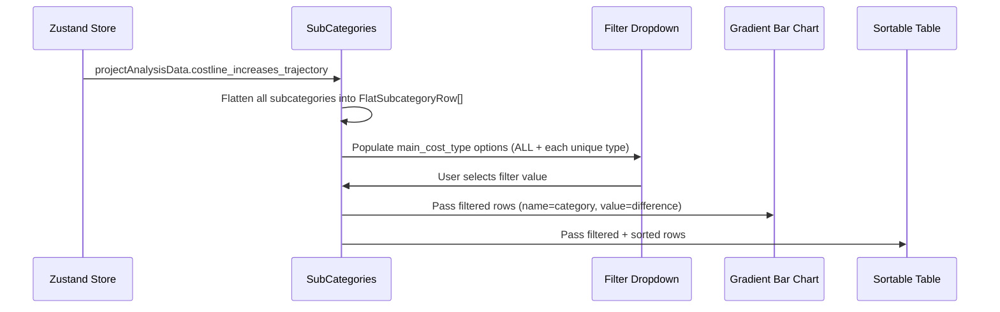
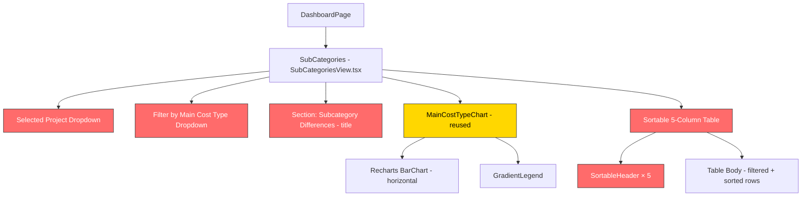

# Technical Requirements Document: Sub Categories Tab

> **Scope**: This document covers the **Sub Categories** tab of the Finance Cost Monitoring Dashboard — the data flow from backend API to frontend rendering, all UI features visible in the reference mockups, and implementation guidance including the "Filter by Main Cost Type" dropdown and sortable table headers.

---

## 1. Overview

The **Sub Categories** tab provides a drill-down one level below the Main Cost Driver. It shows the **subcategories** (the middle tier of the 3-level hierarchy) aggregated across all main cost types, or filtered to a single main cost type. When a user selects a project and clicks **Run Analysis**, this tab displays:

1. **Cost Subcategory Breakdown** — page heading
2. **Selected Project** — dropdown showing the project key with description (same as Main Cost Driver tab)
3. **Filter by Main Cost Type** — a dropdown defaulting to `"ALL"`, listing all unique main cost type names. Selecting one narrows the chart and table to subcategories under that cost type only.
4. **Subcategory Differences (filter-label)** — a horizontal gradient bar chart showing subcategory-level differences, labeled dynamically with the current filter value (e.g., `"Subcategory Differences (ALL)"`)
5. **Data Table** — a **5-column** table with `main_cost_type`, `category`, `file1_metric`, `file2_metric`, `difference`, featuring **sortable column headers**

---

## 2. Data Flow: End-to-End

Like the Main Cost Driver tab, the Sub Categories tab reuses data already fetched and stored in the Zustand store. **No additional API calls are needed.**

```
Zustand store (projectAnalysisData) → SubCategories component → flatten subcategories → filter by main_cost_type → render chart + table
```

### 2.1 Data Derivation

The Sub Categories tab processes `costline_increases_trajectory` from the store, **flattening** each main cost type's `subcategories` array into a unified list:

```
costline_increases_trajectory: [
  { category: "30 - subcontractor costs", subcategories: [ { category: "Project Subcontractor Costs", ... } ] },
  { category: "20 - project material costs", subcategories: [ { category: "HVAC / Architect...", ... }, { category: "Contruction Mate...", ... } ] },
  ...
]
```

**Flattened output** (the working dataset for this tab):

```typescript
interface FlatSubcategoryRow {
  main_cost_type: string; // e.g. "30 - subcontractor costs"
  category: string; // e.g. "Project Subcontractor Costs"
  file1_metric: number;
  file2_metric: number;
  difference: number;
}
```

When `"ALL"` is selected, all rows across all main cost types are combined. When a specific main cost type is selected, only rows belonging to that type are shown.

### 2.2 Sequence



### 2.3 Key Files

| Step                  | File                                                                                                                                      | Role                                                    |
| --------------------- | ----------------------------------------------------------------------------------------------------------------------------------------- | ------------------------------------------------------- |
| State management      | [useDashboardStore.ts](file:///Users/jerryjose/Code/cost-dashboard/nextjs-frontend/app/store/useDashboardStore.ts)                        | Holds `projectAnalysisData` (source of truth)           |
| Data fetching         | [DataFetcher.tsx](file:///Users/jerryjose/Code/cost-dashboard/nextjs-frontend/app/components/dashboard/DataFetcher.tsx)                   | Already fetches all necessary data                      |
| Backend               | [data_processor.py](file:///Users/jerryjose/Code/cost-dashboard/backend-api/app/services/data_processor.py)                               | Builds nested `costline_increases_trajectory` structure |
| **Current rendering** | [CostBreakdownView.tsx](file:///Users/jerryjose/Code/cost-dashboard/nextjs-frontend/app/components/dashboard/views/CostBreakdownView.tsx) | Current (partial) implementation — `depth='sub'`        |
| Tab export            | [views/index.tsx](file:///Users/jerryjose/Code/cost-dashboard/nextjs-frontend/app/components/dashboard/views/index.tsx)                   | Exports `SubCategories` component                       |

---

## 3. API Contract

### 3.1 No New Endpoints

This tab is fully served by the existing `POST /api/analysis/forecast-comparison` endpoint. The relevant nested data is already present in the `costline_increases_trajectory` response field.

### 3.2 Data Shape — Relevant Portion

Each item in `costline_increases_trajectory` has a `subcategories` array:

```json
{
  "costline_increases_trajectory": [
    {
      "category": "30 - subcontractor costs",
      "file1_metric": 644279.0,
      "file2_metric": 691939.0,
      "difference": 47660.0,
      "subcategories": [
        {
          "category": "Project Subcontractor Costs",
          "file1_metric": 644279.0,
          "file2_metric": 691939.0,
          "difference": 47660.0,
          "children": [ ... ]
        }
      ]
    },
    {
      "category": "20 - project material costs",
      "file1_metric": 1155117.0,
      "file2_metric": 1183216.0,
      "difference": 28099.0,
      "subcategories": [
        {
          "category": "HVAC / Architectural Material Costs",
          "file1_metric": 0.0,
          "file2_metric": 1183216.0,
          "difference": 1183216.0,
          "children": [ ... ]
        },
        {
          "category": "Contruction Material Costs",
          "file1_metric": 1155117.0,
          "file2_metric": 0.0,
          "difference": -1155117.0,
          "children": [ ... ]
        }
      ]
    }
  ]
}
```

### 3.3 TypeScript Types (Frontend)

From [api.ts](file:///Users/jerryjose/Code/cost-dashboard/nextjs-frontend/app/lib/api.ts):

```typescript
export interface CostlineTrajectory {
  category: string; // Main cost type
  file1_metric: number;
  file2_metric: number;
  difference: number;
  subcategories: CostlineSubcategory[];
}

export interface CostlineSubcategory {
  category: string; // Subcategory name
  file1_metric: number;
  file2_metric: number;
  difference: number;
  children: CostlineChild[]; // Not used on this tab
}
```

**New derived type for this tab** (to be defined locally in the component):

```typescript
interface FlatSubcategoryRow {
  main_cost_type: string;
  category: string;
  file1_metric: number;
  file2_metric: number;
  difference: number;
}
```

---

## 4. UI Features & Components Breakdown

### 4.1 Page Title: "Cost Subcategory Breakdown"

| Property                   | Detail                                                 |
| -------------------------- | ------------------------------------------------------ |
| **Display text**           | `"Cost Subcategory Breakdown"` — static heading (`h2`) |
| **Current implementation** | ❌ No page title in the current `CostBreakdownView`    |

---

### 4.2 Selected Project Dropdown

| Property                   | Detail                                                                   |
| -------------------------- | ------------------------------------------------------------------------ |
| **Display text**           | Label: `"Selected Project"`. Button: project key (e.g., `"2377 & 8353"`) |
| **Dropdown content**       | Full project description + client on expand                              |
| **Data source**            | `projectKey` from store, `projectAnalysisData.project_meta`              |
| **Current implementation** | ❌ Not present in current `CostBreakdownView`                            |

**Implementation**: Identical pattern to [ProjectSummary.tsx](file:///Users/jerryjose/Code/cost-dashboard/nextjs-frontend/app/components/dashboard/views/ProjectSummary.tsx) and [MainCostDriverView.tsx](file:///Users/jerryjose/Code/cost-dashboard/nextjs-frontend/app/components/dashboard/views/MainCostDriverView.tsx). Copy that pattern as-is.

---

### 4.3 Filter by Main Cost Type Dropdown

This is the **key new feature** unique to this tab.

| Property                   | Detail                                                                                                                 |
| -------------------------- | ---------------------------------------------------------------------------------------------------------------------- |
| **Label**                  | `"Filter by Main Cost Type"`                                                                                           |
| **Default value**          | `"ALL"` — shows subcategories aggregated across all main cost types                                                    |
| **Options**                | `"ALL"` + one option per unique main cost type from `costline_increases_trajectory` (in the order returned by the API) |
| **Effect on chart**        | Chart title changes to `"Subcategory Differences ({selected})"`. Bars update to show only filtered subcategories.      |
| **Effect on table**        | Table rows filtered to matching `main_cost_type`.                                                                      |
| **Styling**                | Dark dropdown, full-width, consistent with the rest of the dashboard                                                   |
| **Current implementation** | ❌ Current `CostBreakdownView` requires mandatory selection (no "ALL" mode, shows empty state when nothing selected)   |

**Options list construction**:

```typescript
const mainCostTypeOptions = [
  "ALL",
  ...data.costline_increases_trajectory.map((c) => c.category),
];
```

**Filter dropdown JSX**:

```tsx
<div>
  <p className="mb-2 text-sm font-medium text-slate-400">
    Filter by Main Cost Type
  </p>
  <div className="relative w-full max-w-xl">
    <select
      value={selectedMainCostType}
      onChange={(e) => setSelectedMainCostType(e.target.value)}
      className="w-full appearance-none rounded border border-slate-700 bg-slate-900 px-4 py-2.5 pr-8 text-sm text-white focus:border-slate-500 focus:outline-none"
    >
      {mainCostTypeOptions.map((opt) => (
        <option key={opt} value={opt}>
          {opt}
        </option>
      ))}
    </select>
    <ChevronDown
      size={16}
      className="pointer-events-none absolute right-3 top-1/2 -translate-y-1/2 text-slate-400"
    />
  </div>
</div>
```

---

### 4.4 Subcategory Differences Horizontal Bar Chart

| Property                   | Detail                                                                                                                               |
| -------------------------- | ------------------------------------------------------------------------------------------------------------------------------------ |
| **Title**                  | `"Subcategory Differences ({selectedMainCostType})"` — updates dynamically (e.g., `"Subcategory Differences (ALL)"`)                 |
| **Chart type**             | Horizontal bar chart — Recharts `BarChart` with `layout="vertical"`                                                                  |
| **Data**                   | Filtered `FlatSubcategoryRow[]`, sorted by `difference` descending for the chart (regardless of table sort)                          |
| **Y-Axis**                 | `category` values (subcategory names), truncated to ~22 chars                                                                        |
| **X-Axis**                 | Difference values. Label: `"Difference (Current - Previous Period)"`                                                                 |
| **Bar coloring**           | Same continuous gradient as Main Cost Driver: green (high positive) → yellow → red (negative/low)                                    |
| **Legend**                 | Vertical gradient legend to the right of the chart, labeled `"Difference"`, scaled to `maxPositive / 1000`                           |
| **Scale range**            | The mockup shows values like `1,200` to `-1,200` — scale is auto-derived from the data, NOT fixed                                    |
| **Current implementation** | ❌ Uses the simpler `VarianceBarChart` (2-color, no legend). Needs replacement with `MainCostTypeChart` (or a shared version of it). |

> [!TIP]
> The gradient chart component `MainCostTypeChart.tsx` created for the Main Cost Driver tab accepts `{ name: string; value: number }[]`. The Sub Categories tab can **reuse this component directly** — just pass the filtered flat subcategory rows mapped to `{ name: category, value: difference }`.

---

### 4.5 Data Table with Sortable Headers

| Property                    | Detail                                                                                                                       |
| --------------------------- | ---------------------------------------------------------------------------------------------------------------------------- |
| **Columns**                 | `#` (row index), `main_cost_type`, `category`, `file1_metric`, `file2_metric`, `difference` — **5 sortable columns + index** |
| **Default sort**            | By `difference` descending                                                                                                   |
| **Sort behavior**           | Same as Main Cost Driver: click to sort, click again to toggle direction, active column shows `↑`/`↓` arrow                  |
| **Number formatting**       | Values divided by 1000, displayed with 3 decimal places (e.g., `644.279`)                                                    |
| **Difference column color** | Red for positive (`text-red-400`), green for negative (`text-green-400`)                                                     |
| **Current implementation**  | ❌ Current table only has 2 columns (`category`, `difference`), no sort controls                                             |

#### 4.5.1 Column Definitions

| Column Header    | Field                               | Type   | Alignment |
| ---------------- | ----------------------------------- | ------ | --------- |
| `main_cost_type` | `FlatSubcategoryRow.main_cost_type` | string | Left      |
| `category`       | `FlatSubcategoryRow.category`       | string | Left      |
| `file1_metric`   | `FlatSubcategoryRow.file1_metric`   | number | Right     |
| `file2_metric`   | `FlatSubcategoryRow.file2_metric`   | number | Right     |
| `difference`     | `FlatSubcategoryRow.difference`     | number | Right     |

> [!NOTE]
> When the filter is set to a specific main cost type (not `"ALL"`), the `main_cost_type` column will show the same value in every row. This is intentional — it ensures the table has a consistent structure regardless of filter state, and keeps the interface predictable.

#### 4.5.2 Sort Logic

```typescript
type SortColumn =
  | "main_cost_type"
  | "category"
  | "file1_metric"
  | "file2_metric"
  | "difference";
type SortDirection = "asc" | "desc";

const sortedRows = useMemo(() => {
  const items = [...filteredRows];
  items.sort((a, b) => {
    let cmp: number;
    if (sortColumn === "main_cost_type" || sortColumn === "category") {
      cmp = a[sortColumn].localeCompare(b[sortColumn]);
    } else {
      cmp = a[sortColumn] - b[sortColumn];
    }
    return sortDirection === "asc" ? cmp : -cmp;
  });
  return items;
}, [filteredRows, sortColumn, sortDirection]);
```

#### 4.5.3 Table Toolbar

| Feature          | Detail                                                                                                |
| ---------------- | ----------------------------------------------------------------------------------------------------- |
| **Row count**    | Small text: `"{n} subcategories"`                                                                     |
| **CSV download** | Icon button that exports the currently **visible** (filtered + sorted) rows to CSV with all 5 columns |

**CSV filename**: `subcategories_{projectKey}_{selectedMainCostType}.csv` (e.g., `subcategories_2377&8353_ALL.csv`)

---

## 5. Data Mapping: API Response → UI Element

| UI Element            | API Response Path                            | Transform             | Example Value                           |
| --------------------- | -------------------------------------------- | --------------------- | --------------------------------------- |
| Page title            | Static                                       | None                  | `"Cost Subcategory Breakdown"`          |
| Selected Project key  | `projectKey` (from store)                    | Direct                | `"2377 & 8353"`                         |
| Project description   | `.project_meta.description`                  | Direct                | `"EPC for Belbazem..."`                 |
| Filter options        | `.costline_increases_trajectory[*].category` | Prefix with `"ALL"`   | `["ALL", "30 - subcontractor...", ...]` |
| Chart section title   | Local filter state                           | String interpolation  | `"Subcategory Differences (ALL)"`       |
| Bar chart Y-Axis      | `FlatSubcategoryRow.category`                | Truncate at ~22 chars | `"HVAC / Architectu…"`                  |
| Bar chart bar value   | `FlatSubcategoryRow.difference`              | Direct (raw)          | `1183216.0`                             |
| Table: main_cost_type | `FlatSubcategoryRow.main_cost_type`          | Direct                | `"20 - project material costs"`         |
| Table: category       | `FlatSubcategoryRow.category`                | Direct                | `"HVAC / Architectural Material Costs"` |
| Table: file1_metric   | `FlatSubcategoryRow.file1_metric`            | `÷ 1000`, 3 decimals  | `0.000`                                 |
| Table: file2_metric   | `FlatSubcategoryRow.file2_metric`            | `÷ 1000`, 3 decimals  | `1183.216`                              |
| Table: difference     | `FlatSubcategoryRow.difference`              | `÷ 1000`, 3 decimals  | `1183.216`                              |

---

## 6. Data Flattening Logic

The flattening is the core data transform for this tab. It runs inside a `useMemo` on `projectAnalysisData`:

```typescript
const allSubcategoryRows = useMemo((): FlatSubcategoryRow[] => {
  if (!data) return [];
  const rows: FlatSubcategoryRow[] = [];
  for (const main of data.costline_increases_trajectory) {
    for (const sub of main.subcategories) {
      rows.push({
        main_cost_type: main.category,
        category: sub.category,
        file1_metric: sub.file1_metric,
        file2_metric: sub.file2_metric,
        difference: sub.difference,
      });
    }
  }
  return rows;
}, [data]);
```

The filter then applies on top of the flattened rows:

```typescript
const filteredRows = useMemo(() => {
  if (selectedMainCostType === "ALL") return allSubcategoryRows;
  return allSubcategoryRows.filter(
    (r) => r.main_cost_type === selectedMainCostType,
  );
}, [allSubcategoryRows, selectedMainCostType]);
```

---

## 7. State Management Details

### 7.1 Zustand Store Fields Used

| Store Field           | Type                      | Purpose                                             |
| --------------------- | ------------------------- | --------------------------------------------------- |
| `projectAnalysisData` | `ProjectAnalysis \| null` | Contains the nested `costline_increases_trajectory` |
| `projectKey`          | `string \| null`          | Project key for the dropdown label                  |
| `analysisLoading`     | `boolean`                 | Loading state                                       |
| `analysisError`       | `string \| null`          | Error state                                         |

### 7.2 Local Component State (New)

| State                  | Type            | Default        | Purpose                                      |
| ---------------------- | --------------- | -------------- | -------------------------------------------- |
| `isDropdownOpen`       | `boolean`       | `false`        | Controls selected project dropdown expansion |
| `selectedMainCostType` | `string`        | `"ALL"`        | The currently selected main cost type filter |
| `sortColumn`           | `SortColumn`    | `'difference'` | Active sort column                           |
| `sortDirection`        | `SortDirection` | `'desc'`       | Sort direction                               |

> [!NOTE]
> `selectedMainCostType` resets to `"ALL"` whenever `projectAnalysisData` changes (i.e., when a new analysis is run). This can be achieved with a `useEffect`:
>
> ```typescript
> useEffect(() => {
>   setSelectedMainCostType("ALL");
> }, [projectAnalysisData]);
> ```

---

## 8. Implementation Guide

### 8.1 Current State of `CostBreakdownView.tsx` (for `depth='sub'`)

The current implementation has these gaps:

| Problem                   | Current Behavior                         | Required Behavior                                                          |
| ------------------------- | ---------------------------------------- | -------------------------------------------------------------------------- |
| No page title             | No heading                               | `"Cost Subcategory Breakdown"`                                             |
| No project dropdown       | No dropdown                              | Project key with expand-to-description                                     |
| Filter requires selection | Empty content until a category is chosen | Defaults to `"ALL"` showing all subcategories                              |
| No flattened view         | Only shows subcategories of one parent   | Flattens all subcategories with `main_cost_type` column                    |
| Chart: 2-color bars       | Red/green only                           | Gradient green→yellow→red                                                  |
| Chart: no legend          | No color scale                           | Vertical gradient legend                                                   |
| Table: 2 columns          | `category`, `difference`                 | `main_cost_type`, `category`, `file1_metric`, `file2_metric`, `difference` |
| Table: no sort            | Static order                             | Click-to-sort headers                                                      |

### 8.2 Recommended Approach: Separate `SubCategoriesView.tsx`

Rather than modifying the shared `CostBreakdownView` (which would also affect Sub-Subcategories), **create a dedicated `SubCategoriesView.tsx`** following the exact same pattern used for `MainCostDriverView.tsx`.

### 8.3 Changes Required

#### 8.3.1 [NEW] `SubCategoriesView.tsx`

**File**: `nextjs-frontend/app/components/dashboard/views/SubCategoriesView.tsx`

Create a new standalone component containing:

1. **Selected Project Dropdown** — identical to `MainCostDriverView.tsx`
2. **Filter by Main Cost Type dropdown** — `"ALL"` + all unique main cost types
3. **`MainCostTypeChart`** (reused) — pass filtered flat rows mapped to `{ name, value }`
4. **Sortable 5-column table** — `main_cost_type`, `category`, `file1_metric`, `file2_metric`, `difference`
5. **Local state** — `isDropdownOpen`, `selectedMainCostType`, `sortColumn`, `sortDirection`
6. **`useMemo` for flattening** — derives `allSubcategoryRows` from `costline_increases_trajectory`
7. **`useMemo` for filtering** — derives `filteredRows` from `allSubcategoryRows` + filter
8. **`useMemo` for sorting** — derives `sortedRows` from `filteredRows` + sort state
9. **CSV download** — exports filtered+sorted rows to CSV

#### 8.3.2 [MODIFY] `views/index.tsx`

**File**: `nextjs-frontend/app/components/dashboard/views/index.tsx`

Update the `SubCategories` export to use the new file:

```diff
-import { SubCategories, SubSubCategories } from "./CostBreakdownView";
+import { SubSubCategories } from "./CostBreakdownView";
+import { SubCategories } from "./SubCategoriesView";
 import { MainCostDriver } from "./MainCostDriverView";
 export { MainCostDriver, SubCategories, SubSubCategories };
```

#### 8.3.3 [MODIFY] `CostBreakdownView.tsx`

**File**: `nextjs-frontend/app/components/dashboard/views/CostBreakdownView.tsx`

Remove the `SubCategories` wrapper export:

```diff
-export const SubCategories = () => <CostBreakdownView depth="sub" />;
 export const SubSubCategories = () => <CostBreakdownView depth="subsub" />;
```

---

## 9. Component Hierarchy



🔴 = New / to be implemented &nbsp;&nbsp; 🟡 = Reused from Main Cost Driver

---

## 10. Detailed Sort & Filter Interaction Behavior

| Scenario                               | Behavior                                                                                             |
| -------------------------------------- | ---------------------------------------------------------------------------------------------------- |
| Page first loads (after Run Analysis)  | `selectedMainCostType = "ALL"`, shows all flattened subcategories, default sort by `difference desc` |
| User selects a specific main cost type | Table and chart update to show only that type's subcategories. Sort state is preserved.              |
| User clicks `category` header          | Table re-sorts alphabetically by `category` within the current filter.                               |
| User clicks same column header again   | Sort direction toggles.                                                                              |
| User clicks a different column header  | Switches sort column, resets to descending.                                                          |
| New analysis run                       | `selectedMainCostType` resets to `"ALL"`, sort state resets to `difference desc`                     |

---

## 11. Value Formatting Rules

All API values are in **thousands**. Display values are divided by 1000 (matching Main Cost Driver formatting):

| API Value    | Table Display |
| ------------ | ------------- |
| `644279.0`   | `644.279`     |
| `1183216.0`  | `1183.216`    |
| `0.0`        | `0.000`       |
| `-1155117.0` | `-1155.117`   |

```typescript
function fmtValue(value: number): string {
  return (value / 1000).toLocaleString(undefined, {
    minimumFractionDigits: 3,
    maximumFractionDigits: 3,
  });
}
```

---

## 12. Backend Changes Required

**None.** The `subcategories` data is already part of every `POST /api/analysis/forecast-comparison` response. No new endpoints, schema changes, or backend processing modifications are needed.

---

## 13. Dependencies & Libraries

All required libraries are already installed. The `MainCostTypeChart` component created for the Main Cost Driver tab is fully reusable here as-is.

| Requirement                   | Status                                        |
| ----------------------------- | --------------------------------------------- |
| Recharts                      | ✅ Already installed                          |
| Lucide React (ChevronDown)    | ✅ Already installed                          |
| `MainCostTypeChart.tsx`       | ✅ Already created for Main Cost Driver       |
| New `FlatSubcategoryRow` type | 🔨 Defined locally in `SubCategoriesView.tsx` |

---

## 14. Summary of Implementation Items

| #   | Item                                                | Type                       | Priority | Effort | Notes                                             |
| --- | --------------------------------------------------- | -------------------------- | -------- | ------ | ------------------------------------------------- |
| 1   | Create `SubCategoriesView.tsx`                      | New file                   | High     | Medium | Main component file with all logic                |
| 2   | Selected Project dropdown                           | In `SubCategoriesView.tsx` | High     | Small  | Copy from `MainCostDriverView.tsx`                |
| 3   | Filter by Main Cost Type dropdown                   | In `SubCategoriesView.tsx` | High     | Small  | `"ALL"` + each main cost type name                |
| 4   | Flatten subcategories logic                         | In `SubCategoriesView.tsx` | High     | Small  | `useMemo` across all `subcategories` arrays       |
| 5   | Filter logic                                        | In `SubCategoriesView.tsx` | High     | Small  | Filter `allSubcategoryRows` by `main_cost_type`   |
| 6   | Reuse `MainCostTypeChart`                           | In `SubCategoriesView.tsx` | High     | Tiny   | No changes to the chart component                 |
| 7   | Sortable 5-column table                             | In `SubCategoriesView.tsx` | High     | Medium | Same `SortableHeader` pattern as Main Cost Driver |
| 8   | Reset filter on new analysis                        | In `SubCategoriesView.tsx` | Medium   | Tiny   | `useEffect` watching `projectAnalysisData`        |
| 9   | CSV download for table                              | In `SubCategoriesView.tsx` | Low      | Small  | Export filtered+sorted rows                       |
| 10  | Update `views/index.tsx`                            | Modify                     | High     | Tiny   | Point `SubCategories` to new file                 |
| 11  | Remove `SubCategories` from `CostBreakdownView.tsx` | Modify                     | High     | Tiny   | Clean up old wrapper                              |
