# Technical Requirements Document: Sub-Subcategories Tab

> **Scope**: This document covers the **Sub-Subcategories** tab of the Finance Cost Monitoring Dashboard — the data flow, all UI features visible in the reference mockups, and implementation guidance, including two cascading filter dropdowns and a sortable 6-column table.

---

## 1. Overview

The **Sub-Subcategories** tab is the deepest drill-down level — it exposes the `children` items (the leaf nodes of the 3-tier hierarchy). The page shows child-level cost differences, filterable by both main cost type and subcategory, with a gradient bar chart and a 6-column sortable table.

When a user selects a project and clicks **Run Analysis**, this tab displays:

1. **Sub-Subcategory-Level Breakdown** — page heading
2. **Selected Project** — dropdown with project key
3. **Filter by Main Cost Type** — dropdown with `"ALL"` + each unique main cost type
4. **Filter by Subcategory** — secondary dropdown, dynamically populated based on the selected main cost type; defaults to `"ALL"`
5. **Children Differences (X → Y)** — horizontal gradient bar chart, labeled with both active filters
6. **Data Table** — a **6-column** sortable table: `main_cost_type`, `subcategory`, `category`, `file1_metric`, `file2_metric`, `difference`

---

## 2. Data Flow: End-to-End

Like all breakdown tabs, this tab is **fully powered by data already in the Zustand store**. No new API calls are required.

```
projectAnalysisData.costline_increases_trajectory
  → [n].subcategories
    → [m].children   ← this tab's data source
```

### 2.1 Data Derivation

The children are the **deepest level** of the 3-tier hierarchy in `costline_increases_trajectory`:

```
costline_increases_trajectory (main cost type)
  └── subcategories (subcategory)
        └── children ← Sub-Subcategories tab data
```

The tab flattens all children across the full tree into a unified list with three ancestry fields:

```typescript
interface FlatChildRow {
  main_cost_type: string; // e.g. "30 - subcontractor costs"
  subcategory: string; // e.g. "Project Subcontractor Costs"
  category: string; // e.g. "Hired Personnel" ← child name
  file1_metric: number;
  file2_metric: number;
  difference: number;
  _originalIndex: number; // 0-based index in the full unfiltered flat list
}
```

The `_originalIndex` field is used to display the row `#` column — it always shows the index in the **full unfiltered dataset**, not the current display position. This matches the mockup where rows show non-sequential indices (e.g., 3, 0, 5, 15) because they represent original positions after a sort has been applied.

### 2.2 Cascading Filter Logic

The two filters work in cascade:

| Filter State                                                           | Subcategory Options                     | Data Shown                       |
| ---------------------------------------------------------------------- | --------------------------------------- | -------------------------------- |
| Main = ALL, Sub = ALL                                                  | ALL + every unique sub across all mains | All children                     |
| Main = "30 - subcontractor costs", Sub = ALL                           | ALL + subs under "30 - sub..." only     | Children under "30 - sub..."     |
| Main = "30 - subcontractor costs", Sub = "Project Subcontractor Costs" | Same as above                           | Children under that specific sub |

> [!IMPORTANT]
> Changing the **Main Cost Type** filter must **reset** the Subcategory filter back to `"ALL"` and repopulate its options list to only show subcategories belonging to the newly selected main type. This prevents invalid combinations (e.g., selecting sub "Labour Costs" while main is "30 - subcontractor costs").

### 2.3 Sequence


---

## 3. API Contract

### 3.1 No New Endpoints

All needed data is returned by `POST /api/analysis/forecast-comparison`. The relevant portion is the two-levels-deep `children` array:

```json
{
  "costline_increases_trajectory": [
    {
      "category": "20 - project material costs",
      "subcategories": [
        {
          "category": "HVAC / Architectural Material Costs",
          "children": [
            {
              "category": "Equipment - Permanent",
              "file1_metric": 0.0,
              "file2_metric": 1183216.0,
              "difference": 1183216.0
            }
          ]
        },
        {
          "category": "Contruction Material Costs",
          "children": [
            {
              "category": "Softwares & IT Accessories",
              "file1_metric": 1155117.0,
              "file2_metric": 0.0,
              "difference": -1155117.0
            }
          ]
        }
      ]
    },
    {
      "category": "30 - subcontractor costs",
      "subcategories": [
        {
          "category": "Project Subcontractor Costs",
          "children": [
            {
              "category": "Hired Personnel",
              "file1_metric": 151270.0,
              "file2_metric": 187346.0,
              "difference": 36076.0
            },
            {
              "category": "General",
              "file1_metric": 443502.0,
              "file2_metric": 451503.0,
              "difference": 8001.0
            }
          ]
        }
      ]
    }
  ]
}
```

### 3.2 TypeScript Types (Frontend)

From [api.ts](file:///Users/jerryjose/Code/cost-dashboard/nextjs-frontend/app/lib/api.ts):

```typescript
export interface CostlineChild {
  category: string; // Child item name (deepest level)
  file1_metric: number;
  file2_metric: number;
  difference: number;
}
```

**New derived type for this tab** (defined locally in the component):

```typescript
interface FlatChildRow {
  main_cost_type: string;
  subcategory: string;
  category: string; // The child's own category label
  file1_metric: number;
  file2_metric: number;
  difference: number;
  _originalIndex: number; // Index in the full unfiltered flat list
}
```

---

## 4. UI Features & Components Breakdown

### 4.1 Page Title: "Sub-Subcategory-Level Breakdown"

| Property                   | Detail                                                      |
| -------------------------- | ----------------------------------------------------------- |
| **Display text**           | `"Sub-Subcategory-Level Breakdown"` — static heading (`h2`) |
| **Current implementation** | ❌ No page title in current `CostBreakdownView`             |

---

### 4.2 Selected Project Dropdown

Identical to the Main Cost Driver and Sub Categories tabs.

| Property                   | Detail                                           |
| -------------------------- | ------------------------------------------------ |
| **Label**                  | `"Selected Project"`                             |
| **Button content**         | Project key (e.g., `"2377 & 8353"`) with chevron |
| **Expanded content**       | Full description + client name                   |
| **Data source**            | `projectKey`, `projectAnalysisData.project_meta` |
| **Current implementation** | ❌ Not present                                   |

---

### 4.3 Filter by Main Cost Type

Identical in population logic to the Sub Categories tab.

| Property                   | Detail                                                                         |
| -------------------------- | ------------------------------------------------------------------------------ |
| **Label**                  | `"Filter by Main Cost Type"`                                                   |
| **Default**                | `"ALL"`                                                                        |
| **Options**                | `"ALL"` + each `costline_increases_trajectory[n].category`                     |
| **On change**              | Repopulates `subcategory` filter options, resets subcategory filter to `"ALL"` |
| **Current implementation** | ❌ Not present                                                                 |

---

### 4.4 Filter by Subcategory

This is the **key new filter unique to this tab**, absent from both Main Cost Driver and Sub Categories.

| Property                           | Detail                                                                 |
| ---------------------------------- | ---------------------------------------------------------------------- |
| **Label**                          | `"Filter by Subcategory"`                                              |
| **Default**                        | `"ALL"`                                                                |
| **Options (when main = ALL)**      | `"ALL"` + every unique subcategory name across **all** main cost types |
| **Options (when main = specific)** | `"ALL"` + only subcategories under the selected main cost type         |
| **Dependency**                     | Must re-derive and reset whenever `selectedMainCostType` changes       |
| **Current implementation**         | ❌ Not present                                                         |

**Options population logic**:

```typescript
const subcategoryOptions = useMemo(() => {
  const relevantMains =
    selectedMainCostType === "ALL"
      ? data.costline_increases_trajectory
      : data.costline_increases_trajectory.filter(
          (c) => c.category === selectedMainCostType,
        );

  const subs = new Set<string>();
  for (const main of relevantMains) {
    for (const sub of main.subcategories) {
      subs.add(sub.category);
    }
  }
  return ["ALL", ...Array.from(subs)];
}, [data, selectedMainCostType]);
```

**Reset subcategory when main changes**:

```typescript
useEffect(() => {
  setSelectedSubcategory("ALL");
}, [selectedMainCostType]);
```

---

### 4.5 Children Differences Chart

| Property                   | Detail                                                                                                                                                                                  |
| -------------------------- | --------------------------------------------------------------------------------------------------------------------------------------------------------------------------------------- |
| **Section title**          | `"Children Differences ({mainFilter} → {subFilter})"` — e.g., `"Children Differences (ALL → ALL)"` or `"Children Differences (30 - subcontractor costs → Project Subcontractor Costs)"` |
| **Chart type**             | Horizontal bar chart — Recharts `BarChart` with `layout="vertical"`                                                                                                                     |
| **Data**                   | Filtered `FlatChildRow[]`, sorted by `difference` descending for the chart                                                                                                              |
| **Y-Axis**                 | `category` (child name), truncated to ~22 chars                                                                                                                                         |
| **X-Axis**                 | Difference values. Label: `"Difference (Current - Previous Period)"`                                                                                                                    |
| **Bar coloring**           | Same gradient: green → yellow → red                                                                                                                                                     |
| **Legend**                 | Vertical gradient legend, same as other tabs                                                                                                                                            |
| **Component**              | Reuse `MainCostTypeChart` — no changes needed                                                                                                                                           |
| **Current implementation** | ❌ Uses `VarianceBarChart` (2-color, no legend)                                                                                                                                         |

---

### 4.6 Data Table with Sortable Headers

| Property                   | Detail                                                                                                              |
| -------------------------- | ------------------------------------------------------------------------------------------------------------------- |
| **Columns**                | `#` (original index), `main_cost_type`, `subcategory`, `category`, `file1_metric`, `file2_metric`, `difference`     |
| **Default sort**           | By `difference` descending                                                                                          |
| **Sort behavior**          | Same click-to-toggle pattern as other tabs                                                                          |
| **`#` column**             | Shows `_originalIndex` — the row's position in the **full unfiltered** flat list, preserved after sorting/filtering |
| **Number formatting**      | `÷ 1000`, 3 decimal places                                                                                          |
| **Difference color**       | Red for positive, green for negative                                                                                |
| **Current implementation** | ❌ Only 2 columns, no sort                                                                                          |

#### 4.6.1 Column Definitions

| Column Header    | Field                         | Type   | Alignment           |
| ---------------- | ----------------------------- | ------ | ------------------- |
| `#`              | `_originalIndex`              | number | Left (small, muted) |
| `main_cost_type` | `FlatChildRow.main_cost_type` | string | Left                |
| `subcategory`    | `FlatChildRow.subcategory`    | string | Left                |
| `category`       | `FlatChildRow.category`       | string | Left                |
| `file1_metric`   | `FlatChildRow.file1_metric`   | number | Right               |
| `file2_metric`   | `FlatChildRow.file2_metric`   | number | Right               |
| `difference`     | `FlatChildRow.difference`     | number | Right               |

> [!NOTE]
> The `#` column shows the **original index** in the full unfiltered flattened list, not the current display row number. This is why the mockup shows non-sequential indices (3, 0, 5, 15, 6...) — the data was sorted by `difference` but the original positions are preserved. This provides a stable identifier for each child row regardless of the current filter or sort state.

#### 4.6.2 Sort Type Definitions

```typescript
type SortColumn =
  | "main_cost_type"
  | "subcategory"
  | "category"
  | "file1_metric"
  | "file2_metric"
  | "difference";
type SortDirection = "asc" | "desc";
```

#### 4.6.3 Table Toolbar

| Feature          | Detail                                                                                            |
| ---------------- | ------------------------------------------------------------------------------------------------- |
| **Row count**    | `"{n} items"`                                                                                     |
| **CSV download** | Exports filtered+sorted rows. Filename: `sub_subcategories_{projectKey}_{safeMain}_{safeSub}.csv` |

---

## 5. Data Mapping: API Response → UI Element

| UI Element                    | API Response Path                                             | Transform                | Example Value                           |
| ----------------------------- | ------------------------------------------------------------- | ------------------------ | --------------------------------------- |
| Page title                    | Static                                                        | None                     | `"Sub-Subcategory-Level Breakdown"`     |
| Selected Project key          | `projectKey` (store)                                          | Direct                   | `"2377 & 8353"`                         |
| Main cost type filter options | `.costline_increases_trajectory[*].category`                  | Prefix `"ALL"`           | `["ALL", "30 - sub...", ...]`           |
| Subcategory filter options    | `.costline_increases_trajectory[*].subcategories[*].category` | Filtered, prefix `"ALL"` | `["ALL", "Labour Costs", ...]`          |
| Chart title                   | Local state                                                   | String interpolation     | `"Children Differences (ALL → ALL)"`    |
| Bar name                      | `FlatChildRow.category`                                       | Truncate to ~22 chars    | `"Equipment - Per…"`                    |
| Bar value                     | `FlatChildRow.difference`                                     | Direct                   | `1183216.0`                             |
| Table: #                      | `FlatChildRow._originalIndex`                                 | Direct                   | `3`                                     |
| Table: main_cost_type         | `FlatChildRow.main_cost_type`                                 | Direct                   | `"20 - project material costs"`         |
| Table: subcategory            | `FlatChildRow.subcategory`                                    | Direct                   | `"HVAC / Architectural Material Costs"` |
| Table: category               | `FlatChildRow.category`                                       | Direct                   | `"Equipment - Permanent"`               |
| Table: file1_metric           | `FlatChildRow.file1_metric`                                   | `÷ 1000`, 3 dec          | `0.000`                                 |
| Table: file2_metric           | `FlatChildRow.file2_metric`                                   | `÷ 1000`, 3 dec          | `1183.216`                              |
| Table: difference             | `FlatChildRow.difference`                                     | `÷ 1000`, 3 dec          | `1183.216`                              |

---

## 6. Data Flattening Logic

```typescript
const allChildRows = useMemo((): FlatChildRow[] => {
  const rows: FlatChildRow[] = [];
  let idx = 0;
  for (const main of data.costline_increases_trajectory) {
    for (const sub of main.subcategories) {
      for (const child of sub.children) {
        rows.push({
          main_cost_type: main.category,
          subcategory: sub.category,
          category: child.category,
          file1_metric: child.file1_metric,
          file2_metric: child.file2_metric,
          difference: child.difference,
          _originalIndex: idx++,
        });
      }
    }
  }
  return rows;
}, [data]);
```

**Then filter in two cascading steps**:

```typescript
// Step 1: Apply main cost type filter
const afterMainFilter = useMemo(() => {
  if (selectedMainCostType === "ALL") return allChildRows;
  return allChildRows.filter((r) => r.main_cost_type === selectedMainCostType);
}, [allChildRows, selectedMainCostType]);

// Step 2: Apply subcategory filter on top
const filteredRows = useMemo(() => {
  if (selectedSubcategory === "ALL") return afterMainFilter;
  return afterMainFilter.filter((r) => r.subcategory === selectedSubcategory);
}, [afterMainFilter, selectedSubcategory]);
```

---

## 7. State Management Details

### 7.1 Zustand Store Fields Used

| Store Field           | Type                      | Purpose                                   |
| --------------------- | ------------------------- | ----------------------------------------- |
| `projectAnalysisData` | `ProjectAnalysis \| null` | Source of `costline_increases_trajectory` |
| `projectKey`          | `string \| null`          | Project key for the dropdown              |
| `analysisLoading`     | `boolean`                 | Loading state                             |
| `analysisError`       | `string \| null`          | Error state                               |

### 7.2 Local Component State (New)

| State                  | Type            | Default        | Reset Trigger                             |
| ---------------------- | --------------- | -------------- | ----------------------------------------- |
| `isDropdownOpen`       | `boolean`       | `false`        | —                                         |
| `selectedMainCostType` | `string`        | `"ALL"`        | New analysis run                          |
| `selectedSubcategory`  | `string`        | `"ALL"`        | New analysis run OR main cost type change |
| `sortColumn`           | `SortColumn`    | `'difference'` | New analysis run                          |
| `sortDirection`        | `SortDirection` | `'desc'`       | New analysis run                          |

**Reset effects**:

```typescript
// Reset all local state when new analysis arrives
useEffect(() => {
  setSelectedMainCostType("ALL");
  setSelectedSubcategory("ALL");
  setSortColumn("difference");
  setSortDirection("desc");
}, [projectAnalysisData]);

// Reset subcategory filter when main filter changes
useEffect(() => {
  setSelectedSubcategory("ALL");
}, [selectedMainCostType]);
```

---

## 8. Implementation Guide

### 8.1 Current State of `CostBreakdownView.tsx` (for `depth='subsub'`)

| Problem                       | Current Behavior                      | Required Behavior                        |
| ----------------------------- | ------------------------------------- | ---------------------------------------- |
| No page title                 | No heading                            | `"Sub-Subcategory-Level Breakdown"`      |
| No project dropdown           | None                                  | Project key with expand-to-description   |
| No main cost type filter      | None                                  | `"ALL"` + each main, resets sub filter   |
| No subcategory filter         | None                                  | `"ALL"` + subs under selected main       |
| Mandatory cascading selection | Requires main → then sub to show data | Both default to ALL showing all children |
| Chart: 2-color bars           | Red/green only                        | Gradient green → yellow → red            |
| Chart: no legend              | None                                  | Vertical gradient legend                 |
| Table: 2 columns              | `category`, `difference`              | 6 data columns + original index          |
| Table: no sort                | Static                                | Click-to-sort all 6 columns              |

### 8.2 Recommended Approach: Separate `SubSubCategoriesView.tsx`

Follow the same pattern as `MainCostDriverView.tsx` and `SubCategoriesView.tsx` — a fully independent, dedicated component file.

### 8.3 Changes Required

#### 8.3.1 [NEW] `SubSubCategoriesView.tsx`

**File**: `nextjs-frontend/app/components/dashboard/views/SubSubCategoriesView.tsx`

Contains:

1. `FlatChildRow` interface (local type)
2. `SortableHeader` sub-component (same pattern as other tabs)
3. `SubSubCategories` export function with:
   - Selected Project dropdown
   - Filter by Main Cost Type select
   - Filter by Subcategory select (cascading)
   - Section heading with dynamic chart title
   - `MainCostTypeChart` (reused, zero changes)
   - Sortable 6+1 column table
   - CSV download

#### 8.3.2 [MODIFY] `views/index.tsx`

**File**: `nextjs-frontend/app/components/dashboard/views/index.tsx`

```diff
 import { MainCostDriver } from "./MainCostDriverView";
 import { SubCategories } from "./SubCategoriesView";
-import { SubSubCategories } from "./CostBreakdownView";
+import { SubSubCategories } from "./SubSubCategoriesView";
 export { MainCostDriver, SubCategories, SubSubCategories };
```

#### 8.3.3 [MODIFY / CLEANUP] `CostBreakdownView.tsx`

**File**: `nextjs-frontend/app/components/dashboard/views/CostBreakdownView.tsx`

Remove the `SubSubCategories` wrapper. After this change, `CostBreakdownView` becomes entirely internal (no exports); it can be refactored or removed in a future cleanup. For now, remove only the export:

```diff
-// Wrapper Components
-// MainCostDriver → MainCostDriverView.tsx
-// SubCategories  → SubCategoriesView.tsx
-export const SubSubCategories = () => <CostBreakdownView depth="subsub" />;
+// All wrappers have been moved to dedicated view files.
+// This file is no longer exported; kept for reference only.
```

---

## 9. Component Hierarchy

```mermaid
graph TD
    A[DashboardPage] --> B[SubSubCategories - SubSubCategoriesView.tsx]

    B --> C[Selected Project Dropdown]
    B --> D[Filter by Main Cost Type Select]
    B --> E[Filter by Subcategory Select - cascading]
    B --> F[Section: Children Differences X → Y]
    B --> G[MainCostTypeChart - reused]
    B --> H[Sortable 6-Column Table]

    G --> I[Recharts BarChart - horizontal]
    G --> J[GradientLegend]

    H --> K["SortableHeader × 6"]
    H --> L[Table Body - filtered + sorted rows]

    style C fill:#ff6b6b,stroke:#333,color:#fff
    style D fill:#ff6b6b,stroke:#333,color:#fff
    style E fill:#ff6b6b,stroke:#333,color:#fff
    style F fill:#ff6b6b,stroke:#333,color:#fff
    style G fill:#ffd700,stroke:#333,color:#000
    style H fill:#ff6b6b,stroke:#333,color:#fff
    style K fill:#ff6b6b,stroke:#333,color:#fff
```



🔴 = New / to implement &nbsp;&nbsp; 🟡 = Reused from Main Cost Driver (no changes)

---

## 10. Filter Interaction Behavior Details

| Scenario                | Main Filter   | Sub Filter        | Sub Filter Options             | Data Shown                       |
| ----------------------- | ------------- | ----------------- | ------------------------------ | -------------------------------- |
| Initial / new analysis  | ALL           | ALL               | ALL + every unique sub         | All children                     |
| User picks a main type  | "30 - sub..." | AUTO-RESETS → ALL | ALL + subs under "30 - sub..." | All children under "30 - sub..." |
| User then picks a sub   | "30 - sub..." | "Project Sub..."  | Same list                      | Children under that specific sub |
| User resets main to ALL | ALL           | AUTO-RESETS → ALL | ALL + every unique sub         | All children                     |

---

## 11. Value Formatting Rules

Same as all other breakdown tabs — API values are in **thousands**, display divides by 1000:

```typescript
function fmtValue(value: number): string {
  return (value / 1000).toLocaleString(undefined, {
    minimumFractionDigits: 3,
    maximumFractionDigits: 3,
  });
}
```

---

## 12. Backend Changes Required

**None.** All data is already present in the `POST /api/analysis/forecast-comparison` response under `costline_increases_trajectory[n].subcategories[m].children`.

---

## 13. Dependencies & Libraries

| Requirement                | Status                                           |
| -------------------------- | ------------------------------------------------ |
| Recharts                   | ✅ Already installed                             |
| Lucide React (ChevronDown) | ✅ Already installed                             |
| `MainCostTypeChart.tsx`    | ✅ Already created, reused as-is                 |
| `FlatChildRow` type        | 🔨 Defined locally in `SubSubCategoriesView.tsx` |

---

## 14. Summary of Implementation Items

| #   | Item                                          | Type        | Priority | Effort |
| --- | --------------------------------------------- | ----------- | -------- | ------ |
| 1   | Create `SubSubCategoriesView.tsx`             | New file    | High     | Medium |
| 2   | Selected Project dropdown                     | In new file | High     | Small  |
| 3   | Filter by Main Cost Type dropdown             | In new file | High     | Small  |
| 4   | Filter by Subcategory dropdown (cascading)    | In new file | High     | Small  |
| 5   | Cascading reset effects (`useEffect`)         | In new file | High     | Tiny   |
| 6   | Children flattening logic (`useMemo`)         | In new file | High     | Small  |
| 7   | Two-step filter logic (`useMemo` × 2)         | In new file | High     | Small  |
| 8   | Reuse `MainCostTypeChart`                     | In new file | High     | Tiny   |
| 9   | Sortable 6-column table with `_originalIndex` | In new file | High     | Medium |
| 10  | CSV download                                  | In new file | Low      | Small  |
| 11  | Update `views/index.tsx`                      | Modify      | High     | Tiny   |
| 12  | Clean up `CostBreakdownView.tsx` exports      | Modify      | High     | Tiny   |
